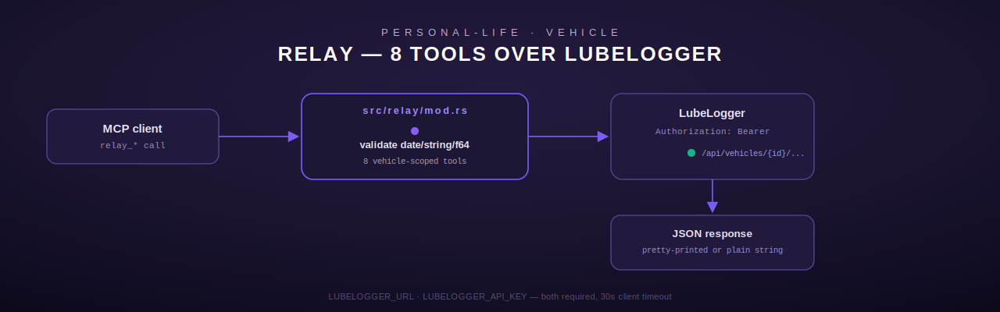

# relay — Vehicle/maintenance tracking (LubeLogger)

[← personal-life index](README.md) · [← tools index](../README.md)

`relay` is an 8-tool module (`src/relay/mod.rs`) that talks to a self-hosted
[LubeLogger](https://lubelogger.com/) instance over its REST API — vehicles, fuel fill-ups,
service records, odometer tracking, and cost/maintenance summaries. Like `ledger` and `vitals`,
it's a pure-`reqwest`, zero-shell-command module (`src/relay/mod.rs:1-4`).

## Configuration

| Env var | Purpose |
| --- | --- |
| `LUBELOGGER_URL` | Base URL of the LubeLogger REST API |
| `LUBELOGGER_API_KEY` | Sent as `Authorization: Bearer {key}` on every request (`RelayConfig::auth_header`, `src/relay/mod.rs:45-47`) |

Both are required; `RelayConfig::from_env` (`src/relay/mod.rs:28-36`) returns
`ToolError::NotConfigured` if either is absent. The shared client has the same flat 30-second
timeout used across this crate's HTTP modules.

## Shared validation helpers

- **`validate_date(s)`** — structural `YYYY-MM-DD` check (identical logic to `ledger`'s and
  `vitals`' — the tests note explicitly that it checks *format*, not calendar validity: month
  `13` structurally passes and is left for the upstream LubeLogger API to reject,
  `src/relay/mod.rs:598-601`).
- **`sanitize_string(s)`** — trim + 500-char cap, applied to `vehicle_id` and `description`.
- **`parse_positive_f64(v, field)`** — despite the name, this actually accepts **non-negative**
  values (`n < 0.0` is rejected, `n == 0.0` is allowed) — used for `gallons`, `miles`, `price`,
  `mileage`. The naming is a minor inconsistency worth flagging: it behaves like a
  "non-negative" parser, not a strictly-positive one (contrast with `vitals`' distinctly-named
  `parse_positive_f64`/`parse_non_negative_f64` pair, which *does* draw that line).

## Tools

### `relay_vehicles`

No arguments. `GET {LUBELOGGER_URL}/api/vehicles`. Returns the raw vehicle list, pretty-printed.

### `relay_fuel_log`

| Field | Type | Required | Notes |
| --- | --- | --- | --- |
| `vehicle_id` | string | yes | Sanitized |
| `date` | string | yes | `YYYY-MM-DD` |
| `gallons` | number | yes | Non-negative (see note above) |
| `miles` | number | yes | Non-negative — the odometer reading at fill-up |
| `price` | number | yes | Non-negative — price **per gallon**, not total cost |

`POST /api/vehicles/{vehicle_id}/fuelrecords` with `{"date", "gallons", "odometer": miles,
"cost": price}` — note the argument names (`miles`, `price`) don't match the LubeLogger wire
field names (`odometer`, `cost`) directly.

- **Output**: `"Fuel record added for vehicle {id} on {date}: {gallons:.2} gal at ${price:.3}/gal, odometer {miles:.0}"`.

### `relay_service_log`

| Field | Type | Required | Notes |
| --- | --- | --- | --- |
| `vehicle_id` | string | yes | Sanitized |
| `date` | string | yes | `YYYY-MM-DD` |
| `description` | string | yes | Sanitized, ≤500 chars, freeform |
| `mileage` | number | yes | Non-negative |

`POST /api/vehicles/{vehicle_id}/servicerecords` with `{"date", "description", "odometer":
mileage}`. Output: `"Service record added for vehicle {id} on {date}: {description}"`.

### `relay_next_due`

| Field | Type | Required |
| --- | --- | --- |
| `vehicle_id` | string | yes |

`GET /api/vehicles/{vehicle_id}/upcoming`. Returns the raw upcoming-maintenance list, or the
literal string `"No upcoming maintenance found"` if the JSON body fails to serialize (a
defensive fallback, not a distinct empty-list branch — an actually-empty array from LubeLogger
would still pretty-print as `[]`).

### `relay_odometer`

| Field | Type | Required |
| --- | --- | --- |
| `vehicle_id` | string | yes |

`GET /api/vehicles/{vehicle_id}/odometer`. Returns the raw odometer object, or `"No odometer
data found"` on a serialization fallback.

### `relay_mileage_update`

| Field | Type | Required | Notes |
| --- | --- | --- | --- |
| `vehicle_id` | string | yes | Sanitized |
| `mileage` | number | yes | Non-negative |

Unlike `relay_fuel_log`/`relay_service_log`, this tool doesn't take a caller-supplied date — it
always records the new odometer entry **dated today**, computed server-side in the tool itself
via `chrono::Local::now().date_naive()` (`src/relay/mod.rs:412`), not passed by the caller.

`POST /api/vehicles/{vehicle_id}/odometerrecords` with `{"date": today, "mileage": mileage}`.
Output: `"Odometer updated for vehicle {id}: {mileage:.0} miles on {today}"`.

### `relay_cost_summary`

| Field | Type | Required |
| --- | --- | --- |
| `vehicle_id` | string | yes |

`GET /api/vehicles/{vehicle_id}/costsummary`. Returns the raw cost breakdown (fuel, service,
parts), or `"No cost data found"` on a serialization fallback.

### `relay_maintenance_history`

| Field | Type | Required | Default | Notes |
| --- | --- | --- | --- | --- |
| `vehicle_id` | string | yes | — | Sanitized |
| `limit` | integer | no | 20 | Clamped to max 200 via `.min(200)` |

`GET /api/vehicles/{vehicle_id}/servicerecords` — note this reuses the **same underlying
endpoint** as `relay_service_log`'s write target, but as a `GET`; "maintenance history" and
"service records" are the same LubeLogger resource viewed two ways. The response is truncated
client-side to `limit` **only if the top-level JSON value is an array**
(`body.as_array_mut()`, `src/relay/mod.rs:534-536`) — if LubeLogger ever wraps the list in an
envelope object instead, this truncation silently does nothing (no error, just an unlimited
response), which is a latent edge case worth flagging to an operator auditing this module.

- **Worked example** (truncation): requesting `limit: 9999` against a 250-record response is
  capped by the request-level clamp to `limit=200` before the request is even sent, then the
  client-side array truncation additionally enforces it — covered by
  `test_relay_maintenance_history_limit_caps_at_200`.

## Registration

`register()` (`src/relay/mod.rs:546-555`) registers all 8 tools via `register_or_replace`.

## Errors summary

| `ToolError` variant | When |
| --- | --- |
| `NotConfigured` | `LUBELOGGER_URL` or `LUBELOGGER_API_KEY` unset |
| `InvalidArgument` | Malformed date, oversized string, negative numeric field, missing required field |
| `Http` | Non-2xx from LubeLogger, or the server is unreachable |
