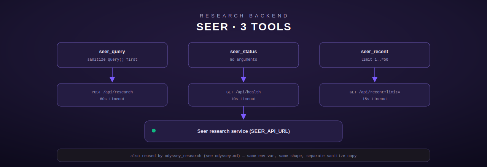

# Seer — research backend integration

[← personal-life index](README.md) · [← tool index](../README.md) · [← docs index](../../README.md)

Three tools that talk to the Seer research service over typed HTTP (`reqwest`), never shell
commands. Defined in [`src/seer/mod.rs`](../../../src/seer/mod.rs). Seer itself is also called
from other modules — `odyssey_research` (see [odyssey](odyssey.md)) reuses the same
`SEER_API_URL` env var and the same `/api/research` endpoint shape, keeping its own separate
sanitization copy by repo convention rather than sharing code across modules.



## Configuration

| Env var | Required | Notes |
|---|---|---|
| `SEER_API_URL` | yes | base URL of the Seer service; trailing slash stripped; unset → `NotConfigured` on every call |

There is no stub-registration path in this module — all three tools always register, and each
independently calls `seer_api_url()` at the top of `execute()` (`src/seer/mod.rs:50-54`).

## Query sanitization

`sanitize_query` (`src/seer/mod.rs:25-44`), used by `seer_query`: strips ASCII control
characters (`0x00`–`0x1F`, `0x7F`), truncates to 500 characters (char-count, not byte-count —
Unicode-safe), and returns `InvalidArgument` if the result is empty or whitespace-only after
cleaning. Unicode content (e.g. accented characters) passes through unmodified.

## seer_query

Submit a research question, get a synthesized answer with cited sources
(`src/seer/mod.rs:102-183`).

**Input schema**

| Field | Type | Required | Default |
|---|---|---|---|
| `question` | string, max 500 chars | **yes** | — |
| `max_sources` | integer | no | `5`, clamped to `1..=20` |

**Behavior.** `POST {SEER_API_URL}/api/research` with `{"question": <sanitized>, "max_sources":
<u32>}`, a **60-second** request timeout. Response deserializes as `{answer?: string, sources:
[{title?, url?}], query?: string}` (all fields optional/defaulted via `#[serde(default)]`, so
a partial or minimal Seer response never fails to parse). Output is rendered as:

```
Question: What is the capital of France?

Answer:
Paris is the capital of France.

Sources:
  1. Wikipedia — https://en.wikipedia.org/wiki/Paris
```

The `"Question:"` line is only included if Seer echoed a `query` field back; an absent
`answer` renders `"(No answer returned)"` rather than omitting the section; sources render
only if the array is non-empty, with `"Untitled"`/`"(no URL)"` placeholders for missing
fields.

**Errors:** `InvalidArgument` for a missing, empty, or control-character-only `question`;
`NotConfigured` if `SEER_API_URL` is unset; `Http` on timeout, transport failure, non-2xx
status, or an unparseable response body.

## seer_status

Check whether the Seer service is online and healthy, no arguments
(`src/seer/mod.rs:189-238`).

**Behavior.** `GET {SEER_API_URL}/api/health`, 10-second timeout. The response body is
optimistically parsed as `{status?: string}`; the reported status string prefers the body's
own `status` field, falling back to `"ok"`/`"unknown"` derived from the HTTP status code alone
if the body doesn't parse or lacks the field. **Only an HTTP-level success returns `Ok`** — even
if the body claims a status, a non-2xx HTTP response always produces an `Http` error (which
still includes the parsed `service_status` in its message for context): `"Seer returned HTTP
{status} (status={service_status})"`.

## seer_recent

Return the most recent research queries Seer has processed (`src/seer/mod.rs:244-303`).

**Input schema**

| Field | Type | Required | Default |
|---|---|---|---|
| `limit` | integer | no | `10`, clamped to `1..=50` |

**Behavior.** `GET {SEER_API_URL}/api/recent?limit={limit}`, 15-second timeout. Response
deserializes as an array of `{query?: string, created_at?: string}`. An empty array renders as
`"No recent research queries found"` (a success, not an error); otherwise each entry renders
as `"  {n}. [{timestamp-or-'(no timestamp)'}] {query-or-'(unknown)'}"`.

## Registration

`register()` (`src/seer/mod.rs:310-319`) always registers all 3 tools via
`register_or_replace` — no configuration gate at registration time; missing configuration
surfaces per-call from `seer_api_url()`.
