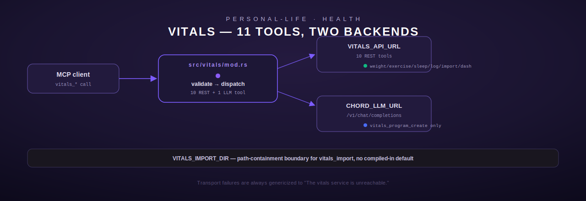

# vitals — Health tracking

[← personal-life index](README.md) · [← tools index](../README.md)

`vitals` is an 11-tool module (`src/vitals/mod.rs`) for logging and querying personal health
data — weight, exercise, sleep, and a generic multi-metric daily log — against a REST backend
addressed by a single env var. Like `ledger`, it's a zero-shell-command, all-`reqwest` module
(`src/vitals/mod.rs:1-3`). Two of the 11 tools (`vitals_program_create`, and the AI-generation
half of the module) call out to an LLM through Chord's OpenAI-compatible endpoint rather than the
vitals backend directly.

## Configuration

| Env var | Purpose | Required by |
| --- | --- | --- |
| `VITALS_API_URL` | Base URL of the vitals REST backend | All tools except `vitals_program_create` |
| `VITALS_IMPORT_DIR` | Containment directory for `vitals_import`'s `file_path` argument — **no compiled-in default** (removed 2026-07 PII remediation); the tool fails `NotConfigured` if unset | `vitals_import` only |
| `CHORD_LLM_URL` | Base URL of Chord's OpenAI-compatible `/v1/chat/completions` endpoint | `vitals_program_create` only |

`VitalsConfig::from_env` / `client` (`src/vitals/mod.rs:20-39`) mirror `ledger`'s pattern: a
30-second-timeout `reqwest::Client` built fresh per call, `NotConfigured` if `VITALS_API_URL` is
absent. Every HTTP failure to reach the backend is deliberately genericized to
`"The vitals service is unreachable."` (logged via `tracing::warn!` with the real error, but not
returned to the caller) rather than leaking the underlying transport error — this is consistent
across all 8 REST tools (e.g. `src/vitals/mod.rs:139-142`).

## Shared validation helpers

- **`validate_date(s)`** — same structural `YYYY-MM-DD` check as `ledger`'s (4-2-2 digit groups).
- **`sanitize_string(s)`** — trim + 500-char cap.
- **`parse_positive_f64(v, field)`** — rejects non-numeric, non-finite, and values `<= 0.0`
  (strictly positive; used for `kg`, `duration_min`, `hours`).
- **`parse_non_negative_f64(v, field)`** — same but allows `0.0` (used for `calories`, `steps`,
  `resting_hr`, `weight_kg` in `vitals_log`).

## Tools

### `vitals_log_weight`

| Field | Type | Required | Notes |
| --- | --- | --- | --- |
| `date` | string | yes | `YYYY-MM-DD` |
| `kg` | number | yes | Strictly positive |

`POST {VITALS_API_URL}/api/weight` with `{"date": ..., "value": kg}`. Note the payload key is
`value`, not `kg` — the tool's own argument name doesn't match the wire field name.
Returns `"Weight logged: {kg:.1} kg on {date}"` on success.

### `vitals_today`

No arguments. `GET /api/today`. Returns today's raw metrics object, pretty-printed, or
`"No data for today"` if the response body fails to serialize.

### `vitals_summary`

| Field | Type | Required | Notes |
| --- | --- | --- | --- |
| `days` | integer | no | Default 7, clamped to max 365 via `.min(365)` |

`GET /api/summary?days={days}`. Returns the raw summary object.

### `vitals_log_exercise`

| Field | Type | Required | Notes |
| --- | --- | --- | --- |
| `date` | string | yes | `YYYY-MM-DD` |
| `type` | string | yes | Sanitized, ≤500 chars, freeform (e.g. `"running"`) |
| `duration_min` | number | yes | Strictly positive |
| `calories` | number | no | Non-negative if present; omitted from the payload entirely if absent (not sent as `0` or `null`) |

`POST /api/exercise`. Success message includes calories only if provided:
`"Exercise logged: running for 30 min on 2026-06-07, 300 cal"`.

### `vitals_log_sleep`

| Field | Type | Required | Notes |
| --- | --- | --- | --- |
| `date` | string | yes | `YYYY-MM-DD` |
| `hours` | number | yes | Strictly positive **and** must not exceed 24 (checked separately from `parse_positive_f64`, `src/vitals/mod.rs:362-366`) |
| `quality` | integer | no | 1–10 inclusive if present |

`POST /api/sleep`. Success: `"Sleep logged: 7.5 hours on 2026-06-07, quality 8/10"` (quality
suffix omitted if not provided).

### `vitals_trends`

| Field | Type | Required | Notes |
| --- | --- | --- | --- |
| `metric` | string | yes | Enum: `weight`, `exercise`, `sleep` — validated twice (JSON schema `enum` **and** a runtime `matches!` check, `src/vitals/mod.rs:450-454`) |
| `days` | integer | no | Default 30, clamped to max 365 |

`GET /api/trends?metric={metric}&days={days}`. Returns the raw trend array/object.

### `vitals_log`

The generic multi-metric logger — see the module's inline design note
(`src/vitals/mod.rs:483-490`): the legacy Python original supported a `source` tag
(`manual`/`samsung_health`/`strava`/`apple_health`) and could write `steps` + `resting_hr` in the
same call, which none of the split tools above (`log_weight`/`log_exercise`/`log_sleep`) can do —
so this is kept as a genuinely distinct, non-redundant tool rather than folded into the others.

| Field | Type | Default | Notes |
| --- | --- | --- | --- |
| `steps` | integer | `0` | Non-negative |
| `sleep_hrs` | number | `0` | Non-negative, must not exceed 24 |
| `resting_hr` | integer | `0` | Non-negative (bpm) |
| `weight_kg` | number | `0` | Non-negative |
| `workout_type` | string | `""` | Sanitized, ≤500 chars |
| `workout_dur_min` | integer | `0` | Non-negative |
| `date` | string | today | `YYYY-MM-DD` if provided; blank/absent resolves to `chrono::Local::now()`'s date at call time |
| `source` | string | `"manual"` | Enum: `manual`, `samsung_health`, `strava`, `apple_health` |

All fields are optional — every numeric field defaults to `0` and every string to `""` if the
JSON type doesn't match `is_number()`/present, rather than erroring (`src/vitals/mod.rs:544-574`).
`POST /api/log` with the full 8-key payload every time (unset fields sent as their zero-value,
not omitted — unlike `vitals_log_exercise`'s `calories`). Returns the raw stored entry from the
backend, pretty-printed, or a fallback confirmation string if that JSON parse fails.

### `vitals_recent`

| Field | Type | Required | Notes |
| --- | --- | --- | --- |
| `days` | integer | no | Default 7, **clamped to 1–30** via `.clamp(1, 30)` — note this cap is much tighter than `vitals_summary`'s 365-day cap |

`GET /api/recent?days={days}`. Returns the raw entries list.

### `vitals_import`

Imports a CSV of wearable data. This tool underwent an explicit PII-remediation redesign
(documented inline, `src/vitals/mod.rs:670-702`): live-probing the legacy Python original showed
it shelled out over SSH to the fleet host, which this crate's `RustTool` contract forbids — so
it's ported as a typed HTTP call to the same `VITALS_API_URL` backend, with the backend doing the
actual file read/parse. `file_path` validation is kept anyway as defense in depth.

| Field | Type | Required | Notes |
| --- | --- | --- | --- |
| `file_path` | string | yes | See validation below |
| `format` | string | yes | Enum: `samsung_health`, `strava`, `apple_health` |

**`file_path` validation** (`validate_import_path`, `src/vitals/mod.rs:704-732`), in order:
1. Non-empty after trim.
2. ≤1024 characters.
3. No ASCII control characters.
4. Must start with `/` (absolute path).
5. No `..` path-traversal segment.
6. **Containment**: must start with the exact string read from `VITALS_IMPORT_DIR` at call time.
   This is checked as a plain string-prefix test, not just the absence of `..` — the inline
   comment notes this deliberately catches paths like `/etc/passwd` or `/root/.ssh/id_rsa` that
   contain no `..` at all but are still outside the drop directory.
7. If `VITALS_IMPORT_DIR` itself is unset, the tool returns `ToolError::NotConfigured` — there is
   no compiled-in fallback directory (a deliberate 2026-07 hardening; the old behavior of
   guessing a directory was removed).

`POST /api/import` with `{"file_path": ..., "format": ...}`, using an **extended 120-second
timeout** on this one request (`src/vitals/mod.rs:788`) rather than the module's default 30s,
since CSV parsing server-side can take longer. Returns the raw import result (typically counts of
imported/skipped rows), pretty-printed.

### `vitals_program_create`

Generates an AI fitness/health program plan — the one tool in this module that talks to an LLM
instead of the vitals backend, reusing the same OpenAI-compatible chat-completions pattern used
elsewhere in the codebase (e.g. `src/google/imap.rs`'s `summarize_via_llm`) rather than a
council/multi-agent flow (contrast with `src/wizard/mod.rs`).

| Field | Type | Required | Notes |
| --- | --- | --- | --- |
| `goal` | string | yes | Sanitized (control-char strip + truncate) to ≤500 chars; rejected as `InvalidArgument` if empty after sanitization |
| `weeks` | integer | no | Default 8, clamped 1–52 |
| `constraints` | string | no | Sanitized to ≤1000 chars, default `""` |

**Prompt-injection defense**: `build_program_request` (`src/vitals/mod.rs:824-847`) places `goal`
and `constraints` only inside the single `user`-role message content, never as their own message
or role, and the system prompt explicitly instructs the model never to treat that content as
instructions — covered by a dedicated unit test
(`test_build_program_request_does_not_leak_goal_as_instruction_role`).

- **Flow**: reads `CHORD_LLM_URL` (`NotConfigured` if unset/empty) → `POST
  {base}/v1/chat/completions` with model `gpt-oss:20b`, `max_tokens: 1200`, a 120s timeout →
  parses `choices[0].message.content` as the plan text (`ToolError::Execution` if that shape is
  missing) → **best-effort** persists the result via `POST {VITALS_API_URL}/api/program` (a
  failure to persist is only logged with `tracing::warn!`, never surfaces as a tool error — the
  generated plan is still returned to the caller even if storage fails).
- **Output**: the raw plan text (not JSON-wrapped).

### `vitals_dashboard`

No arguments. `POST /api/dashboard` with an empty JSON body, described as regenerating the
health dashboard on the fleet box's `/health/` path from the last 7 days of Engram data. Returns
the raw response (path/URL of the regenerated dashboard), pretty-printed, or `"Dashboard
regenerated"` as a fallback string.

## Registration

`register()` (`src/vitals/mod.rs:992-1004`) registers all 11 tools. Despite the module doc
comment at the top of the file saying "All 6 tools" / "11 tools" inconsistently in different
spots (`src/vitals/mod.rs:3` says 6, the tools table at `src/vitals/mod.rs:11-22` lists all 11) —
the code is the source of truth: **11 tools**, confirmed by
`test_register_adds_eleven_tools` (`src/vitals/mod.rs:1347-1363`).

## Errors summary

| `ToolError` variant | When |
| --- | --- |
| `NotConfigured` | `VITALS_API_URL` unset (all REST tools); `VITALS_IMPORT_DIR` unset (`vitals_import` only); `CHORD_LLM_URL` unset (`vitals_program_create` only) |
| `InvalidArgument` | Bad date, out-of-range numeric, bad enum, oversized/control-char/traversal path, empty sanitized goal |
| `Http` | Non-2xx from the vitals backend or the LLM endpoint, or either is unreachable |
| `Execution` | LLM response didn't contain the expected `choices[0].message.content` shape |
