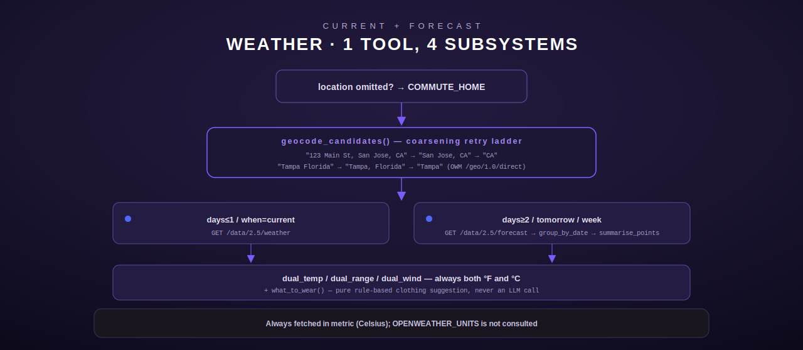

# Weather — current conditions & multi-day forecast

[← personal-life index](README.md) · [← tool index](../README.md) · [← docs index](../../README.md)

A single tool, `weather`, backed by OpenWeatherMap. Despite being one tool it carries
substantial logic: a `COMMUTE_HOME` location fallback, dual °F/°C rendering for an
internationally-traveling operator, a street-address-to-city geocoding fallback ladder, and a
rule-based (non-LLM) "what to wear" suggestion engine. Defined in
[`src/weather/mod.rs`](../../../src/weather/mod.rs).



## Configuration

| Env var | Required | Notes |
|---|---|---|
| `OPENWEATHER_API_KEY` | yes | unset → `NotConfiguredStub` registered instead of the real tool |
| `OPENWEATHER_API_URL` | no | default `https://api.openweathermap.org` |
| `COMMUTE_HOME` | no | shared with the [commute](commute.md) module; used as the location fallback when `location` is omitted |

`OPENWEATHER_UNITS` is **not** consulted — the tool documents this explicitly
(`src/weather/mod.rs:42-43`): it always fetches in metric (canonical Celsius) and renders
both unit systems regardless of locale, so there is nothing for a units env var to override.

## weather

**Input schema**

| Field | Type | Required | Default |
|---|---|---|---|
| `location` | string: city, address, landmark, or `lat,lon` | no | falls back to `COMMUTE_HOME`; `NotConfigured` if both are absent |
| `days` | integer, 1–7 | no | takes precedence over `when` when present; `1` → current, `2`–`7` → that many forecast days (clamped to ~6 available) |
| `when` | string enum: `current`\|`tomorrow`\|`week` | no | `current`; ignored if `days` is given |

### Location resolution (BUG 1 fix)

`resolve_location` (`src/weather/mod.rs:101-113`): an absent or empty (including
whitespace-only) `location` falls back to `COMMUTE_HOME`. This is deliberate — the module
comment frames it as the fix for a legacy bug where the model would ask "which city?" instead
of assuming home. If `COMMUTE_HOME` is also unset, the tool returns a clear
`NotConfigured` error rather than guessing. An Engram "where does {user} live" lookup was
considered and explicitly rejected as out of scope — `COMMUTE_HOME` is meant to be the single
env-based source of truth (`src/weather/mod.rs:14-17`).

### Geocoding fallback ladder (BUG 2-adjacent fix)

OpenWeatherMap's `/geo/1.0/direct` resolves **city-level** names only, and answers HTTP `200`
with an **empty array** (not an error) for anything it can't place — notably a full street
address (the default `COMMUTE_HOME` value) or a comma-less multi-word string like "Tampa
Florida". `geocode_candidates` (`src/weather/mod.rs:235-270`) generates a finest-to-coarsest,
deduplicated list of queries to retry against `geocode_once` until one hits:

1. **Comma-coarsening** (addresses): the full string, then progressively dropping leading
   comma-separated (street-level) components — `"123 Main St, San Jose, CA 95123"` →
   `"San Jose, CA 95123"` → `"CA 95123"`.
2. **Space-coarsening** (only applied when the string has *no* comma and multiple words): try
   inserting a comma before the last word (`"Tampa Florida"` → `"Tampa, Florida"`) and try
   dropping the trailing word (`"Tampa Florida"` → `"Tampa"`). Multi-word cities are preserved
   — `"San Jose California"` yields `"San Jose, California"` and `"San Jose"`, never a
   first-token-only `"San"`.

A literal `"lat,lon"` pair (verified via `parse_coord_pair`) skips geocoding entirely. If every
candidate returns empty, the tool raises `NotFound("Could not geocode '{location}' (try a city
name, e.g. 'San Jose, CA')")`.

### Mode resolution: `days` vs. legacy `when`

`Mode::resolve` (`src/weather/mod.rs:718-751`): if `days` is present, it wins unconditionally
— `days <= 1` → `Mode::Current`, `days >= 2` → `Mode::Days(n)` clamped to
`FORECAST_MAX_DAYS = 7` (the free `/data/2.5/forecast` tier realistically returns ~6 distinct
calendar days: today + 5). Only when `days` is absent does `when` apply: `"current"` →
current, `"tomorrow"` → the forecast's 2nd distinct date only, `"week"` → up to 7 days. An
unrecognized `when` value is `InvalidArgument`.

### Dual-unit rendering

All temperatures are fetched in metric (Celsius) and rendered as both systems, always
(`src/weather/mod.rs:117-144`):

| Helper | Output shape |
|---|---|
| `dual_temp(c)` | `"72°F / 22°C"` |
| `dual_range(min_c, max_c)` | `"54–68°F / 12–20°C"` |
| `dual_wind(ms)` | `"11 km/h / 7 mph"` (m/s → km/h ×3.6, → mph ×2.237) |

### Rule-based "what to wear"

`what_to_wear` (`src/weather/mod.rs:152-185`) is pure Rust logic, never an LLM call. A base
suggestion is keyed on `feels_c` (preferred) or `temp_c`:

| Threshold (°C) | Suggestion |
|---|---|
| ≤ −10 | Bitter cold: heavy insulated coat, hat, gloves, scarf, thermal layers |
| ≤ 0 | Freezing: heavy coat, hat, gloves, warm layers |
| ≤ 8 | Cold: warm coat and a sweater |
| ≤ 15 | Cool: a jacket or hoodie |
| ≤ 22 | Mild: a light jacket or long sleeves |
| ≤ 28 | Warm: t-shirt and shorts |
| > 28 | Hot: light, breathable clothing; stay hydrated, sun protection |

Modifiers append onto the base: `snow`/`sleet` in the description → "waterproof boots for
snow"; `rain`/`drizzle`/`thunderstorm` → "bring an umbrella or a waterproof layer"; wind ≥
8 m/s → "windproof outer layer (it's gusty)".

### Precipitation

`precip_phrase` (`src/weather/mod.rs:475-491`) combines probability (`pop`, forecast only,
0–1 → `"{n}% chance"`) with volume (`rain_mm`/`snow_mm`, summed from the OWM `rain`/`snow`
object's `"3h"` or `"1h"` window via `volume_mm`) into a single labeled phrase, e.g.
`"precipitation 80% chance, 1.5 mm rain"`. Returns `None` (nothing appended) when there is
nothing to report.

### Output shapes

**Current** (`format_current`, `src/weather/mod.rs:527-578`):
```
Current weather for San Francisco: clear sky, 64°F / 18°C (feels like 63°F / 17°C), humidity 60%, wind 11 km/h / 7 mph. What to wear: Mild: a light jacket or long sleeves.
```

**Multi-day forecast** (`format_day` per day, `src/weather/mod.rs:583-599`), grouped by
calendar date via `group_by_date` and reduced per day via `summarise_points` (min/max temp
across the day's 3-hour points, plus the day's single most-frequent condition string,
determined by simple mode count):
```
3-day forecast for San Francisco:
- 2026-06-09: clear sky, 63–68°F / 17–20°C
- 2026-06-10: light rain, 54–66°F / 12–19°C, precipitation 80% chance, 1.5 mm rain — What to wear: Cool: a jacket or hoodie; bring an umbrella or a waterproof layer.
- 2026-06-11: few clouds, 66–77°F / 19–25°C
```

**Errors:** `InvalidArgument` for a non-integer `days` or unrecognized `when`; `NotConfigured`
if `location` and `COMMUTE_HOME` are both absent, or `OPENWEATHER_API_KEY` is unset;
`NotFound` when every geocoding candidate is exhausted, or the forecast/tomorrow branch finds
no data for the requested day; `Http` on any transport failure or non-2xx upstream response.

## Registration

`register()` (`src/weather/mod.rs:762-772`) registers the live `Weather` tool when
`OPENWEATHER_API_KEY` is present, otherwise a `NotConfiguredStub` under the same tool name
`weather`.
