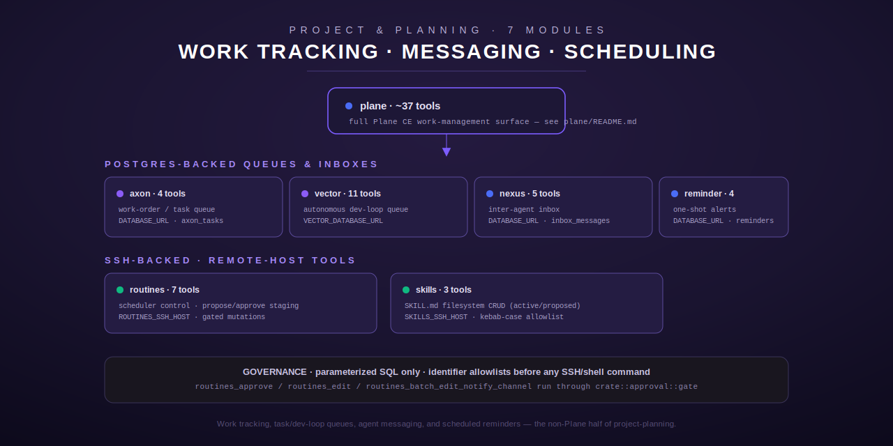

# Project & Planning

[← tool index](../README.md) | [← docs index](../../README.md)

Work tracking, task/dev-loop queues, inter-agent messaging, and scheduled
reminders — seven modules total. Six are documented on this page (the
non-Plane modules); the seventh, `plane`, is large enough to be its own
sub-section.

## Modules

| Module | Tools | What it does | Page |
| --- | --- | --- | --- |
| `plane` | 37 | Full Plane CE work-management surface — issues, modules, multi-identity (`PLANE_PAT_<NAME>`) CRUD, prefix registry. The largest single module in the hub. | [`plane/README.md`](plane/README.md) |
| `axon` | 4 | Postgres-backed work-order / task queue: submit, status, list, and access-controlled cancel over `DATABASE_URL`. | [`axon.md`](axon.md) |
| `vector` | 11 | Autonomous dev-loop task queue over a dedicated `VECTOR_DATABASE_URL` — submit/status/list/halt/resume/logs/clear-done plus queue-depth, last-error, project, and history reporting tools. | [`vector.md`](vector.md) |
| `nexus` | 5 | Postgres-backed inter-agent inbox — send, check, read, ack, history over `DATABASE_URL`. | [`nexus.md`](nexus.md) |
| `reminder` | 4 | One-shot scheduled alerts with a from-scratch natural-language time parser (`set`/`list`/`cancel`/`poll`); the `poll` tool is what lumina-core's Matrix scheduler calls every 60 seconds. | [`reminder.md`](reminder.md) |
| `routines` | 7 | Named, cron-like scheduler routines owned by an external scheduler host, reached over SSH — read-only list/history, ungated propose/pending staging, and three tools (`approve`, `edit`, `batch_edit_notify_channel`) gated behind the shared human-approval mechanism. | [`routines.md`](routines.md) |
| `skills` | 3 | Filesystem CRUD over a fleet host's `active/`/`proposed/` skill directories in agentskills.io format, reached over SSH. | [`skills.md`](skills.md) |

## Two backing patterns

The six non-Plane modules split cleanly into two transport/storage patterns:

- **Postgres-backed** (`axon`, `vector`, `nexus`, `reminder`) — each tool
  opens a fresh `sqlx::PgPool` connection per call against a Postgres
  connection string read from the environment (`DATABASE_URL` for axon/
  nexus/reminder; a dedicated `VECTOR_DATABASE_URL` for vector). Every
  query is built with bound parameters — no SQL string interpolation
  anywhere across these four modules. Access control, where it exists
  (axon's assignee check, nexus's `to_agent` scoping), is enforced entirely
  in the SQL `WHERE` clause, not in application code.
- **SSH-backed** (`routines`, `skills`) — both reach a remote host (an
  external scheduler service for `routines`; the fleet host for `skills`)
  over the synchronous `ssh2` crate, wrapped in `tokio::task::spawn_blocking`
  for async callers. Both validate any caller-supplied identifier (routine
  `name`/`channel`; skill `skill_name`) against a strict allowlist regex
  *before* it can reach a remote path or shell command, and both quote or
  escape free-text values rather than trusting Rust's `Debug` formatting
  (which does not neutralize shell metacharacters).

## Guarded / destructive tools

Most tools in this domain are unauthenticated beyond whatever identity
argument the caller supplies (see each module page for exactly how thin
that check is). The one place real gating exists is `routines`:
`routines_approve`, `routines_edit`, and
`routines_batch_edit_notify_channel` all call `crate::approval::gate` before
doing anything — a human operator must reply `approve <CODE>` out of band
(never inside the agentic loop) before the call proceeds, and the grant is
bound to the exact tool name *and* argument content so it cannot be replayed
against a different request. `routines_batch_edit_notify_channel` is
flagged in its own tool description as destructive: it deletes and
recreates every routine on the scheduler, wiping their run history, purely
because the scheduler's own edit command doesn't support changing the
notify-channel field any other way.

## Conventions on these pages

Per the [Terminus docs style guide](../../README.md#conventions-used-across-these-docs):
every claim below is sourced from reading the actual tool registration site,
handler, and argument struct in this repo (cited as `file.rs:line`), input
schemas are given in full (field / type / required / default), and each
page covers output shape, error/edge cases, and a worked example.

[← tool index](../README.md) | [← docs index](../../README.md)
