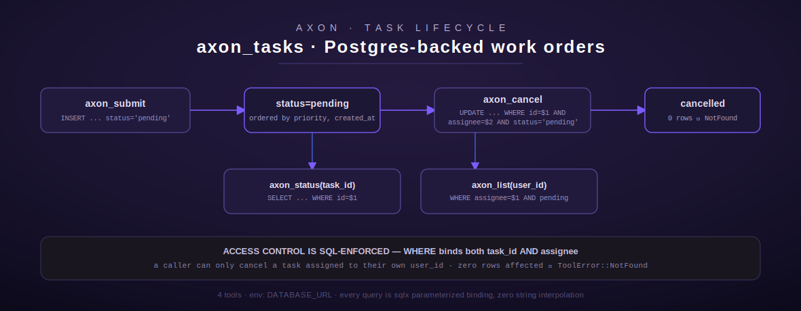

# axon

[← project-planning index](README.md) | [← docs index](../../README.md)

Axon is a Postgres-backed work-order / task queue. It is the simplest of the
project-planning queue modules — one table (`axon_tasks`), four tools, no
priority-workflow ceremony beyond a fixed enum and no SSH/remote-host
component. Source: [`src/axon/mod.rs`](../../../src/axon/mod.rs).



## Overview

All four tools (`axon_submit`, `axon_status`, `axon_list`, `axon_cancel`) share
one connection helper, `get_pool()` (`src/axon/mod.rs:26-35`), which reads
`DATABASE_URL` from the environment and opens a fresh `sqlx::PgPool` per call
(`PgPool::connect`, not a pooled/cached handle reused across calls). If
`DATABASE_URL` is unset, every tool fails fast with
`ToolError::NotConfigured("DATABASE_URL not set — Axon tools require a
Postgres connection")` before any network I/O.

Every query in this module is built with `sqlx::query`/`sqlx::query_as` and
`.bind(...)` calls — there is no string interpolation of caller-supplied
values into SQL anywhere in the file (verified by reading every query
literal). The module's own unit tests assert this directly
(`test_axon_cancel_access_control_enforced_by_sql`,
`test_axon_list_sql_uses_parameters`, `src/axon/mod.rs:423-442`).

The underlying table (not defined in this file, created out-of-band) is
inferred from the queries to have at least: `id` (bigint/serial), `project_id`
(text), `title` (text), `priority` (text), `assignee` (text), `status`
(text), `created_at` (timestamptz), `updated_at` (timestamptz, written by
`axon_cancel` but never read in this module).

**Env vars:** `DATABASE_URL` (Postgres connection string) — the only
configuration surface. No other env var is read anywhere in this module.

**Auth / gating:** none of the four tools go through the approval gate
(`crate::approval::gate`) — Axon is considered a low-risk, self-service task
queue. The only access control present is SQL-level: `axon_cancel`'s `UPDATE`
binds both `task_id` *and* `assignee` in its `WHERE` clause, so a caller can
only cancel a task assigned to their own `user_id` — there is no
application-level identity check beyond "the `user_id` argument you pass
matches the row's `assignee` column." Nothing stops a caller from passing a
different `user_id` than their own identity; Axon trusts the argument.

## Tool: `axon_submit`

**Purpose:** insert a new work order (task) into the queue in `pending`
status. Source: `src/axon/mod.rs:42-114`.

**Input schema:**

| Field | Type | Required | Default |
| --- | --- | --- | --- |
| `project_id` | string | yes | — |
| `title` | string | yes | — |
| `priority` | string, enum `["low","normal","high","urgent"]` | no | `"normal"` |
| `assignee` | string | yes | — |

**Behavior:**
1. Extracts `project_id`, `title`, `assignee` as strings — missing/wrong-type
   fields fail with `ToolError::InvalidArgument`.
2. `priority` defaults to `"normal"` via `.unwrap_or("normal")` if absent,
   then is validated a second time in application code against the same
   four-value allowlist (`src/axon/mod.rs:85-91`) — an out-of-enum value
   (e.g. `"critical"`) is rejected with `InvalidArgument` even though the
   JSON Schema also declares the enum (defense in depth: the schema is
   advisory to the calling model, the Rust check is load-bearing).
3. Opens a pool, then a single parameterized `INSERT ... RETURNING id`
   against `axon_tasks`, hardcoding `status = 'pending'` and
   `created_at = NOW()` server-side (not caller-controlled).
4. Returns a plain-text confirmation string containing the new numeric task
   id.

**Output shape:** plain text, not JSON —
`"Work order submitted (id={id}, project={project_id}, assignee={assignee}, priority={priority})"`.

**Errors:** `InvalidArgument` (missing/bad-type fields, bad priority),
`NotConfigured` (`DATABASE_URL` unset), `Database` (connection or insert
failure, wrapping the underlying `sqlx::Error`).

**Worked example:**

```json
// request
{"project_id": "LUM", "title": "Draft the S110 docs plan", "priority": "high", "assignee": "lumina"}
```
```
// response (plain text)
Work order submitted (id=482, project=LUM, assignee=lumina, priority=high)
```

## Tool: `axon_status`

**Purpose:** fetch a single task's current status by numeric id. Source:
`src/axon/mod.rs:121-174`.

**Input schema:**

| Field | Type | Required | Default |
| --- | --- | --- | --- |
| `task_id` | integer | yes | — |

**Behavior:** a single parameterized `SELECT project_id, title, status,
assignee, created_at FROM axon_tasks WHERE id = $1`, no user/assignee filter
— any caller can look up any task's status by id (read access is not scoped
to the caller). Returns `ToolError::NotFound` if no row matches.

**Output shape:** plain text, multi-line:

```
Task id=482
Project:  LUM
Title:    Draft the S110 docs plan
Status:   pending
Assignee: lumina
Created:  2026-07-10 09:14:02.113 UTC
```

**Errors:** `InvalidArgument` (missing/non-integer `task_id`), `NotConfigured`,
`Database`, `NotFound` (`"Task id={task_id} not found"`).

## Tool: `axon_list`

**Purpose:** list pending tasks assigned to a given user, priority-sorted.
Source: `src/axon/mod.rs:181-242`.

**Input schema:**

| Field | Type | Required | Default |
| --- | --- | --- | --- |
| `user_id` | string | yes | — |

**Behavior:** `SELECT id, project_id, title, priority, created_at FROM
axon_tasks WHERE assignee = $1 AND status = 'pending'`, ordered by a `CASE`
expression that ranks `urgent` < `high` < `normal` < anything else, then
`created_at ASC` within the same priority tier (`src/axon/mod.rs:216-223`).
Only `pending` tasks are returned — halted/cancelled/done/error states are
invisible to this tool (there is no equivalent "list all statuses" tool in
Axon, unlike Nexus's `nexus_history`).

**Output shape:** plain text. Empty case: `"No pending tasks for
'{user_id}'"`. Non-empty case: a header line (`"{N} pending task(s) for
'{user_id}':"`) followed by one line per task:
`"[id={id}] [{priority}] {created_at} project={project_id} | {title}"`.

**Errors:** `InvalidArgument` (missing `user_id`), `NotConfigured`,
`Database`.

## Tool: `axon_cancel`

**Purpose:** cancel a pending task — the one mutating, access-controlled tool
in this module. Source: `src/axon/mod.rs:249-304`.

**Input schema:**

| Field | Type | Required | Default |
| --- | --- | --- | --- |
| `task_id` | integer | yes | — |
| `user_id` | string | yes | — |

**Behavior:** `UPDATE axon_tasks SET status = 'cancelled', updated_at = NOW()
WHERE id = $1 AND assignee = $2 AND status = 'pending'`. All three
predicates matter:
- `id = $1` — targets exactly one row.
- `assignee = $2` — **this is the entire access-control mechanism.** A task
  not assigned to the caller's `user_id` cannot be cancelled by them.
- `status = 'pending'` — a task already cancelled, done, or otherwise
  terminal cannot be re-cancelled (no-op, not an error toggle).

If the `UPDATE` affects zero rows, the tool cannot distinguish "task doesn't
exist" from "task exists but isn't yours" from "task exists but isn't
pending" — it returns one merged `ToolError::NotFound` message covering all
three: `"Task id={task_id} not found, not assigned to '{user_id}', or not in
pending state"`. This is a deliberate information-hiding property (it does
not leak whether a task id exists or who it belongs to), documented in the
module's tests as SQL-enforced access control, not application-logic access
control.

**Output shape:** plain text, `"Task id={task_id} cancelled"` on success.

**Errors:** `InvalidArgument` (missing/bad-type fields), `NotConfigured`,
`Database`, `NotFound` (the merged message above).

**Worked example:**

```json
// request
{"task_id": 482, "user_id": "lumina"}
```
```
// response (plain text)
Task id=482 cancelled
```

## Registration

`pub fn register(registry: &mut ToolRegistry)` (`src/axon/mod.rs:311-316`)
registers all four tools unconditionally via `register_or_replace` — there is
no config check at registration time; `DATABASE_URL` is only validated
lazily, the first time a tool actually executes.

[← project-planning index](README.md) | [← docs index](../../README.md)
