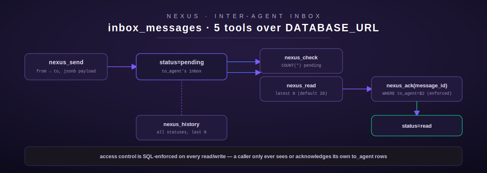

# nexus

[← project-planning index](README.md) | [← docs index](../../README.md)

Nexus is a Postgres-backed inter-agent inbox — one agent (or user) sends a
message to another; the recipient checks, reads, and acknowledges it. Five
tools, one table (`inbox_messages`), shared `DATABASE_URL`. Source:
[`src/nexus/mod.rs`](../../../src/nexus/mod.rs).



## Overview

The module doc comment documents the real table schema directly
(`src/nexus/mod.rs:14-18`), copied here verbatim because it is the clearest
single source of truth for the data model:

```
inbox_messages:
  id uuid, from_agent varchar(32), to_agent varchar(32),
  message_type varchar(32), priority varchar(16) default 'normal',
  payload jsonb, status varchar(16) default 'pending',
  created_at timestamptz, read_at timestamptz nullable
```

`get_pool()` (`src/nexus/mod.rs:32-41`) is the same pattern as axon's — reads
`DATABASE_URL`, opens a fresh `PgPool::connect` per call, and fails fast with
`NotConfigured` if the env var is unset.

Message bodies are stored inside a `payload jsonb` column, not a plain text
column — `nexus_send` wraps the caller's `body` string in `{"body": <text>}`
before insert (`src/nexus/mod.rs:82-83`), and `nexus_read` unwraps it back out
on the way out, falling back to the raw payload text if the JSON shape is
unexpected (`src/nexus/mod.rs:202-205`). This leaves room for future payload
fields beyond `body` without a schema migration, though nothing in this
module currently writes anything else into `payload`.

**Env vars:** `DATABASE_URL` only.

**Auth / gating:** none of the five tools are gated. Every read/write is
scoped to `to_agent = $N` in its `WHERE` clause — this is SQL-level, not
application-level, access control, identical in spirit to axon's assignee
check: a caller can only see or acknowledge messages addressed to the
`user_id` they pass, but nothing verifies that `user_id` is genuinely their
own identity. `nexus_send`'s `from` field is similarly self-asserted, not
verified against caller identity.

## Tool: `nexus_send`

**Purpose:** send a message from one agent to another. Source:
`src/nexus/mod.rs:47-103`.

| Field | Type | Required | Default |
| --- | --- | --- | --- |
| `from` | string | yes | — |
| `to` | string | yes | — |
| `body` | string | yes | — |
| `message_type` | string | no | `"message"` |
| `priority` | string | no | `"normal"` (free text — `low`/`normal`/`high`/`urgent`/`critical` per the description, but **not enforced** by an enum or app-level check, unlike axon's `priority`) |

**Behavior:** serializes `{"body": body}` to a JSON string, then `INSERT INTO
inbox_messages (from_agent, to_agent, message_type, priority, payload)
VALUES ($1,$2,$3,$4,$5::jsonb) RETURNING id::text`. `status` and
`created_at` are left to their column defaults (`'pending'`, presumably
`now()`) rather than being set explicitly in the `INSERT`.

**Output:** plain text — `"Message sent (id={uuid})"`.

**Errors:** `InvalidArgument` (missing `from`/`to`/`body`), `Database`
(payload serialization failure — practically unreachable since `body` is
already a valid string — or the insert itself failing), `NotConfigured`.

**Worked example:**

```json
{"from": "lumina", "to": "axon", "body": "S110 docs pass is complete for project-planning", "priority": "normal"}
```
```
Message sent (id=3fa1c2de-9b77-4e10-8b21-2b6a1b9e0c44)
```

## Tool: `nexus_check`

**Purpose:** count pending messages for a recipient — a lightweight
"do I have mail" check. Source: `src/nexus/mod.rs:109-149`.

| Field | Type | Required | Default |
| --- | --- | --- | --- |
| `user_id` | string | yes | — |

**Behavior:** `SELECT COUNT(*) FROM inbox_messages WHERE to_agent = $1 AND
status = 'pending'`.

**Output:** `"No pending messages"` if zero, else `"{N} pending message(s) in
inbox"`.

## Tool: `nexus_read`

**Purpose:** fetch the N most recent pending messages, with bodies unwrapped
from their JSON payload. Source: `src/nexus/mod.rs:155-212`.

| Field | Type | Required | Default |
| --- | --- | --- | --- |
| `user_id` | string | yes | — |
| `limit` | integer | no | `20` (clamped `1..=100`) |

**Behavior:** `SELECT id::text, from_agent, message_type, payload::text,
created_at FROM inbox_messages WHERE to_agent = $1 AND status = 'pending'
ORDER BY created_at DESC LIMIT $2`. **Does not mark messages as read** —
reading is non-destructive; only `nexus_ack` transitions status. For each
row, the payload JSON string is re-parsed and the `body` field extracted; if
parsing fails or `body` is absent, the raw payload string is shown instead
(`src/nexus/mod.rs:202-205`) — a defensive fallback rather than a hard error.

**Output:** plain text. Empty: `"No pending messages"`. Non-empty: a header
(`"{N} pending message(s):"`) then per-message blocks:
```
[id={uuid}] {created_at} from={from} type={message_type}
{body}
---
```

## Tool: `nexus_ack`

**Purpose:** mark a specific message as read — the one mutating,
access-controlled tool in this module. Source: `src/nexus/mod.rs:218-266`.

| Field | Type | Required | Default |
| --- | --- | --- | --- |
| `user_id` | string | yes | — |
| `message_id` | string (UUID) | yes | — |

**Behavior:** `UPDATE inbox_messages SET status = 'read', read_at = NOW()
WHERE id = $1::uuid AND to_agent = $2 AND status = 'pending'`. Same three-way
merged-`NotFound` pattern as axon_cancel: zero rows affected could mean the
message doesn't exist, isn't addressed to this `user_id`, or was already
acknowledged — the tool cannot and does not distinguish which, returning
`"Message id={message_id} not found for user '{user_id}', or already
acknowledged"`.

**Output:** `"Message id={message_id} acknowledged"`.

**Errors:** `InvalidArgument` (missing fields — note `message_id` is
documented as "must be a UUID string" but the Rust code does not actually
validate UUID *format* before binding; an invalid UUID string will fail at
the `::uuid` cast inside Postgres and surface as a `Database` error, not
`InvalidArgument`), `NotFound`, `NotConfigured`, `Database`.

## Tool: `nexus_history`

**Purpose:** fetch recent messages **in any status** (pending, read, etc.)
for a recipient — the audit-trail counterpart to `nexus_read`'s
pending-only view. Source: `src/nexus/mod.rs:272-325`.

| Field | Type | Required | Default |
| --- | --- | --- | --- |
| `user_id` | string | yes | — |
| `limit` | integer | no | `20` (clamped `1..=100`) |

**Behavior:** `SELECT id::text, from_agent, message_type, status, created_at
FROM inbox_messages WHERE to_agent = $1 ORDER BY created_at DESC LIMIT $2` —
note this selects `status` instead of `payload`, so message bodies are
**not** included in history output, only metadata.

**Output:** `"Last {N} message(s):"` header then per-line:
`"[id={uuid}] [{status}] {created_at} from={from} type={message_type}"`.

## Registration

`pub fn register(registry: &mut ToolRegistry)` (`src/nexus/mod.rs:331-337`)
registers all five tools via `register_or_replace`.

[← project-planning index](README.md) | [← docs index](../../README.md)
