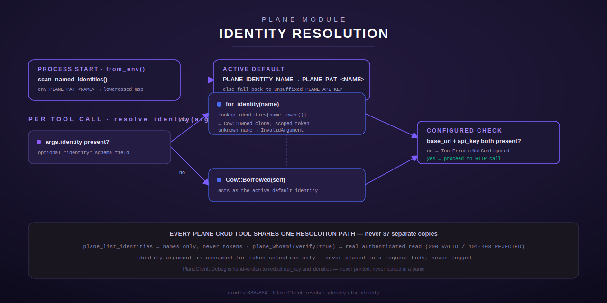

[← Tool reference](../../README.md) · [← docs index](../../../README.md)

# Plane — Plane CE work-management surface

The `plane` module (`src/plane/mod.rs`, `src/plane/prefix.rs`, `src/plane/types.rs`) wraps the
[Plane CE](https://plane.so) REST API and exposes it as **37 Rust tools**: 28 core `plane_*`
tools registered from `mod.rs`, plus 5 `plane_prefix_*` sub-tools registered from the `prefix`
sub-module. It is the largest single module in the Terminus tool hub
(`mod.rs:1-3` doc comment: "Plane CE tool implementations (CHORD-06, hardened per the
plane-helper port)").

This page covers the shared machinery every tool in the group depends on: configuration,
multi-identity auth, request pacing/caching, the optional shared-Redis backend, and the
project-id UUID gotcha. The per-tool reference is split across four sibling pages so each stays
readable:

| Page | Tools |
| --- | --- |
| [`work-items.md`](work-items.md) | CRUD + query over work items (issues): list/get/create/update/delete, filtered listing, listing by state group, get-by-sequence, batch create, close, recent activity, resolve a state name |
| [`projects-cycles-modules.md`](projects-cycles-modules.md) | Projects, cycles (sprints), and modules: list/get, module CRUD, module-issue membership |
| [`metadata-identity.md`](metadata-identity.md) | Workflow states, labels, members, comments, and the multi-identity tools (`plane_whoami`, `plane_list_identities`) |
| [`prefix-registry.md`](prefix-registry.md) | The `plane_prefix_*` sub-tools — a queryable registry of per-spec item-ID prefixes (baseline TOML + Redis overlay) |

## What Plane CE is, in this context

Plane CE is the self-hosted project-management tool this constellation uses for issue/sprint
tracking. This module is a Rust rewrite ("a *replacement*, not a port") of an earlier Python
`plane_client.py` helper, hardened along the way — see [Multi-identity](#multi-identity) for the
specific design change from the Python version.

## Configuration

All configuration is environment variables — there is no hardcoded URL or token anywhere in the
module (`mod.rs:6-17`):

| Variable | Required | Default | Purpose |
| --- | --- | --- | --- |
| `PLANE_API_URL` | at call time | — | Base URL of the Plane CE instance. Trailing `/` is stripped. |
| `PLANE_API_KEY` | at call time | — | Default API key/token (the unsuffixed identity). |
| `PLANE_PAT_<NAME>` | no | — | Additional named identities, e.g. `PLANE_PAT_CLAUDE`. See [Multi-identity](#multi-identity). |
| `PLANE_IDENTITY_NAME` | no | — | Human name of the identity `PLANE_API_KEY` should be treated as the active default for. |
| `PLANE_WORKSPACE` | no | `moosenet` | Workspace slug used in every request path. |
| `PLANE_RPM` | no | `60` | Requests-per-minute budget before `PLANE_RATE_SHARE` division. |
| `PLANE_RATE_SHARE` | no | `3` | Divides `PLANE_RPM` (60/3 = 20 effective RPM = 3s minimum interval between requests). |
| `PLANE_CACHE_TTL_SECS` | no | `5` | GET response cache TTL, in seconds. |
| `PLANE_REDIS_URL` | no | — | Optional shared Redis backend for the cache + rate limiter + prefix overlay. Unset = pure in-process behavior. |
| `PLANE_REDIS_PASSWORD` | no | — | Redis `AUTH` password, kept out of the URL so it never lands in a log line. |
| `PLANE_REDIS_TIMEOUT_MS` | no | `200` | Per-Redis-op timeout in milliseconds. |

When `PLANE_API_URL` is not set, every `plane_*` tool still **registers** normally — it just
returns `ToolError::NotConfigured` on every call (`mod.rs:32-33`, `PlaneClient::not_configured`,
`mod.rs:811-816`). This means the tool catalog is stable regardless of deployment configuration;
only calling a tool fails.

`PlaneClient::configured()` (`mod.rs:782-785`) is `true` only when **both** `base_url` and
`api_key` (the resolved, possibly per-identity, token) are present — checked once per call inside
`resolve_identity` (`mod.rs:860-863`), so every tool gets an identical, consistent
`NotConfigured` error shape.

## Multi-identity

This is explicitly called out in the module doc as **a replacement, not a port**, of the Python
`plane_client.py` `whoami()` design (`mod.rs:35-45`). The Python version resolved identity by
scanning *other agents' plaintext `.env` files* for a matching token substring — a
credential-sprawl anti-pattern the Rust rewrite deliberately does not repeat. Instead:

- **`PLANE_PAT_<NAME>` env vars** are the *only* source of named identities. `scan_named_identities`
  (`mod.rs:664-681`) is the single place this prefix is matched against the environment — reads
  only this process's own environment (populated by the operator's secret manager at process
  start), never another process's files. Names are lowercased; an empty-valued var is treated as
  absent.
- **`PlaneClient::for_identity(name)`** (`mod.rs:823-836`) returns a clone of the client scoped to
  a named identity's token — sharing the same HTTP client, rate limiter, and GET cache `Arc`s, so
  identities never contend for separate rate budgets or leak each other's cached responses (the
  cache key includes the active token precisely to prevent that — see
  [GET cache](#get-cache-in-process-optional-shared-redis)).
- **The active default identity** is resolved once at `PlaneClient::from_env()` construction
  (`mod.rs:721-780`): if `PLANE_IDENTITY_NAME` names a configured `PLANE_PAT_<NAME>`, the default
  token genuinely *is* that identity's token (so `PLANE_IDENTITY_NAME=lumina` really routes calls
  through `PLANE_PAT_LUMINA`); otherwise it falls back to the unsuffixed `PLANE_API_KEY`, so a
  deployment with only `PLANE_API_KEY` configured is unaffected.
- **`PlaneClient::resolve_identity(args)`** (`mod.rs:855-864`) is the *one shared dispatch point*
  every Plane CRUD tool uses — every tool accepts an optional `identity` string argument (added
  uniformly by `with_identity_param`, `mod.rs:1159-1164`); when present it resolves to that named
  identity, otherwise the call acts as the active default. The `identity` argument is consumed for
  token selection only — never placed into a request body, never logged.
- **`plane_list_identities`** and **`plane_whoami`** (documented in
  [`metadata-identity.md`](metadata-identity.md)) are the introspection tools: the former lists
  configured names (never token values), the latter reports/verifies which identity is active.

`PlaneClient`'s `Debug` implementation is hand-written (`mod.rs:709-719`) to redact `api_key`
entirely and print only a count for `identities` — so a stray `{:?}` in a log line or panic
message can never leak a token.

## The project-id UUID gotcha

Plane CE's project-scoped endpoints require the project's **UUID** in the URL path — passing a
human identifier like `LM` yields a 404 ("Page not found"). Every tool that takes a `project_id`
argument accepts *either* form and resolves it transparently via
`PlaneClient::resolve_project_id` (`mod.rs:897-921`):

- `is_uuid(s)` (`mod.rs:85-106`) checks the canonical 8-4-4-4-12 hyphenated shape — if it matches,
  the string is used unchanged with **no network call**.
- Otherwise, the workspace's project list is fetched (through the same cached, rate-limited
  transport as every other GET) and matched against `identifier` (case-insensitive) or an exact
  `id`. No match → `ToolError::NotFound`.

This means callers can pass `"LM"` or a raw UUID interchangeably to any `project_id` argument
throughout the module.

## Request pacing and caching

Ported from the Python client's `fcntl.flock`-guarded `/tmp/plane-helper.lock` +
`/tmp/plane-helper-cache.json` pacing (`mod.rs:491-652`), now in-process with an optional shared
Redis backend:

### Rate limiter

Every call, across every tool and every identity, passes through one `RateLimiter`
(`mod.rs:500-583`) built from `PLANE_RPM` / `PLANE_RATE_SHARE` (default 60/3 = a 3-second minimum
interval). Two gates apply in order, with the local lock held across both so a process's own
Plane calls are strictly serialized:

1. **Per-process floor** — `min_interval` since this process's last *actual* issue time, always
   enforced first regardless of Redis state.
2. **Shared Redis slot** (only if `PLANE_REDIS_URL` is set) — an atomic Lua-scripted reservation
   (`RATE_RESERVE_LUA`, `mod.rs:138-154`) against the Redis server's own clock, so every terminus
   instance talking to Plane paces against one coordinated fleet-wide budget instead of each
   keeping a private counter.

### GET cache

`GetCache` (`mod.rs:594-652`) is an in-memory TTL cache (`PLANE_CACHE_TTL_SECS`, default 5s),
optionally backed by the same shared Redis. The cache key is `token\0url` — **not just the URL**
— because Plane GET responses are not uniformly workspace-scoped (`plane_list_projects` only
returns projects the calling token's user belongs to; member listings can vary by role), so two
identities sharing this cache's `Arc` must never be served each other's cached response for the
same URL. Reads prefer the shared Redis cache when configured; a miss or any Redis failure falls
through to (and warms) the in-process map.

### Optional shared Redis backend

When `PLANE_REDIS_URL` is set, the GET cache **and** the rate limiter both coordinate through one
Redis instance (`RedisBackend`, `mod.rs:240-474`), so every terminus process sharing that Redis
sees one cache and one rate budget. This is **robustly fail-open**:

- Every Redis operation is wrapped in a short timeout (`PLANE_REDIS_TIMEOUT_MS`, default 200ms)
  and guarded by a `CircuitBreaker` (`mod.rs:163-234`) that opens after 3 consecutive failures and
  half-opens after a 5-second cooldown for exactly one probe (no thundering herd).
- On any Redis error, timeout, or breaker-open state, the operation transparently falls back to
  the in-process cache/limiter — a Redis outage never blocks, meaningfully slows (beyond one short
  timeout), or fails a Plane call.
- Exactly one degradation warning is logged per outage episode, not one per call.
- Cache keys are namespaced and SHA-1-hashed (`redis_cache_key`, `mod.rs:476-489`) so the raw
  token never appears in Redis key space, and two identities requesting the same URL hash to
  different keys.
- When `PLANE_REDIS_URL` is unset or empty, behavior is byte-for-byte identical to a pure
  in-process cache + limiter — this backend adds nothing observable to a single-instance
  deployment.

### Retry semantics

`request_with_retry` (`mod.rs:1031-1102`) is the core retry loop every GET/POST/PATCH/DELETE goes
through, ported from the Python client's semantics:

- Every attempt is paced by the rate limiter first.
- **401/403 are never retried** — auth failures are terminal.
- **429** respects a `Retry-After` header (clamped to 60s to bound a hostile/misconfigured
  server), falling back to a backoff table (`[2, 5, 15]` seconds) if absent.
- **5xx and network errors** retry with the same backoff table.
- Maximum 3 attempts total; an exhausted retry returns the response as-is so `check_status`
  surfaces a proper error with the response body.

## Errors

`PlaneClient::check_status` (`mod.rs:1105-1121`) maps non-success HTTP responses to `ToolError`
uniformly across every tool:

| HTTP status | `ToolError` variant |
| --- | --- |
| 404 | `NotFound` |
| 401 / 403 | `Http` ("Plane authentication failed") |
| 422 | `InvalidArgument` |
| anything else non-2xx | `Http` (status + body) |

Individual tools additionally return `InvalidArgument` for missing/empty required arguments (via
the `require_arg!` macro, `mod.rs:1127-1134`) and `NotConfigured` when `PLANE_API_URL`/token are
absent.

## Registration

`plane::register(registry)` (`mod.rs:2856-2904`) builds one shared `Arc<PlaneClient>` from the
environment, registers all 28 core tools against it, then calls `prefix::register(registry)` to
register the 5 prefix sub-tools — so `plane_prefix_*` tools always surface alongside `plane_*` in
both the core Chord registry and the personal registry. A tool that fails to register (name
collision) logs a warning rather than panicking the whole registry.

Two tools (`PlaneCreateWorkItem::new`, `mod.rs:1341-1353`, and `PlaneListWorkItemsFiltered::new`,
`mod.rs:2395-2400`) additionally expose a `pub(crate)` constructor for an in-crate, in-process
caller (e.g. the Scribe module's discrepancy reporter) to call the tool's `execute()` directly as
a plain function call rather than a second MCP round trip — still the single sanctioned Plane
access path, just invoked in-process within the same crate rather than through the registry
lookup. `pub(crate)`, not `pub`, is deliberate: no external API surface should be able to
construct these tools directly, bypassing `register()`'s catalog.
