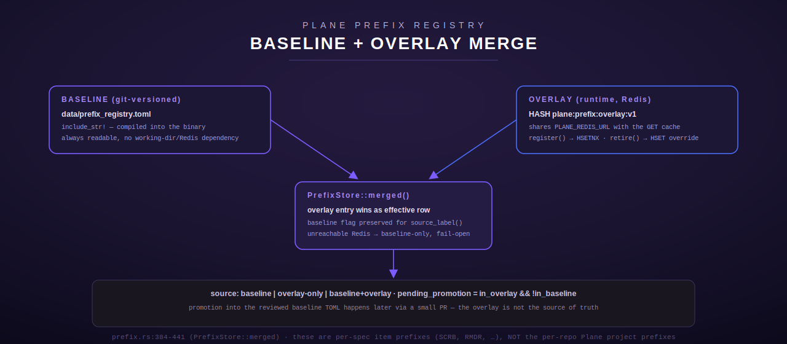

[← Plane overview](README.md) · [← Tool reference](../../README.md)

# Plane — prefix registry (`plane_prefix_*`)

`src/plane/prefix.rs` is a **sub-module** of `plane`, registered from the same entry point
(`plane::register` calls `prefix::register` at the end, `mod.rs:2900-2903`) so its 5 tools always
surface alongside the other 32 `plane_*` tools. It gives the constellation's "a prefix must be
unique — check the registry" convention a real, queryable, programmatic backing
(`prefix.rs:7-11`).

**These are per-spec item-ID prefixes** (`SCRB`, `ROUT`, `RMDR`, `PSEC`, …) — short, 2-8
character codes used as the prefix for individual spec/issue ids within a project. They are
**not** the per-repo Plane *project* prefixes (`HARM`/`LUM`/`CHRD`/`TERM`/`RAIL`/`HW`/`PSH`),
which are a separate, smaller, hand-maintained set. A `PrefixEntry`'s own `project` field records
which of those owning projects a given item prefix belongs to.



## Table of contents

- [Hybrid store](#hybrid-store)
- [Data model](#data-model)
- [Validation rules](#validation-rules)
- [Fail-open](#fail-open)
- [plane_prefix_list](#plane_prefix_list)
- [plane_prefix_get](#plane_prefix_get)
- [plane_prefix_check](#plane_prefix_check)
- [plane_prefix_register](#plane_prefix_register)
- [plane_prefix_retire](#plane_prefix_retire)

## Hybrid store

Two layers, merged on every read (`PrefixStore::merged`, `prefix.rs:400-440`):

- **Baseline** — `data/prefix_registry.toml`, a git-versioned, human-reviewed TOML file. It is
  compiled directly into the binary via `include_str!` (`prefix.rs:58`), so a baseline read always
  succeeds regardless of the process's working directory or whether Redis is reachable. Parsed
  and normalized (prefixes uppercased) exactly once, cached in a `OnceLock` (`baseline()`,
  `prefix.rs:112-130`). A malformed baseline TOML never panics the process — it logs a warning and
  degrades to an empty baseline (the overlay still works).
- **Overlay** — a runtime claim store in the *same* shared Plane Redis the GET cache and rate
  limiter use (`PLANE_REDIS_URL` / `PLANE_REDIS_PASSWORD` / `PLANE_REDIS_TIMEOUT_MS`; see
  [overview](README.md#optional-shared-redis-backend)), stored as JSON values in one Redis hash
  key, `plane:prefix:overlay:v1` (`prefix.rs:70`). A new claim from `plane_prefix_register` lands
  here immediately — fast, and visible across every terminus instance sharing that Redis.
  **Promotion** of an overlay claim into the reviewed baseline TOML happens later, out of band,
  through a small reviewed PR that adds a `[[prefix]]` block and drops the overlay field — the
  overlay is deliberately not treated as the durable source of truth.

When both layers have an entry for the same prefix, **the overlay entry wins** as the effective
row (so a retire override or an unpromoted claim takes effect immediately), while
`MergedRow.in_baseline`/`in_overlay` flags both provenances (`prefix.rs:344-382`).
`source_label()` reports one of `"baseline"`, `"overlay-only"`, `"baseline+overlay"`, or
`"unknown"`.

## Data model

`PrefixEntry` (`prefix.rs:74-98`):

| Field | Type | Default | Notes |
| --- | --- | --- | --- |
| `prefix` | string | — | e.g. `SCRB`; stored/compared uppercased |
| `name` | string | `""` | Full human-readable name/title |
| `project` | string | `""` | Owning Plane project (`HARM`/`LUM`/`CHRD`/`TERM`/`RAIL`/`HW`/`PSH`) |
| `spec_id` | string | `""` | Originating spec id, e.g. `S101-prefix-library` |
| `status` | string | `"active"` | One of `active`/`retired`/`ingested`/`complete` |
| `description` | string | `""` | One-line summary |
| `created` | string | `""` | ISO date `YYYY-MM-DD` |

## Validation rules

`validate_prefix` (`prefix.rs:135-154`): trimmed and uppercased, then must be **2-8 characters**,
first character an ASCII uppercase letter, remaining characters uppercase letters or digits.
Covers historical shapes like `S35`, `COND2`, `DPROMPT`. `normalize_status` (`prefix.rs:156-165`)
lowercases and checks membership in `VALID_STATUSES = ["active", "retired", "ingested",
"complete"]`.

## Fail-open

Every overlay operation is wrapped in the shared `PLANE_REDIS_TIMEOUT_MS` timeout. If Redis is
unconfigured or unreachable:

- **Reads** (`plane_prefix_list`, `plane_prefix_get`, `plane_prefix_check`) transparently fall
  back to the baseline alone — never an error, never a hang.
- **Writes** (`plane_prefix_register`, `plane_prefix_retire`) return a clear, structured
  "overlay unavailable — use the file/PR path" result (`ok: false`, a `reason` field, and a
  message naming `data/prefix_registry.toml`) instead of crashing or silently discarding the
  claim.

`overlay_note(reachable)` (`prefix.rs:444-450`) is the shared phrase generator behind every tool's
`"overlay"` output field: `None` → "no Redis overlay configured (baseline-only)"; `Some(true)` →
"overlay reachable"; `Some(false)` → "overlay configured but unreachable — baseline-only
(fail-open)".

**Concurrency**: `plane_prefix_register`'s write uses an atomic Redis `HSETNX`
(`PrefixOverlay::put_new`, `prefix.rs:299-317`) rather than a read-then-write, closing the TOCTOU
gap between the collision check and the write — two concurrent registrations of the same free
prefix cannot both succeed.

## plane_prefix_list

`prefix.rs:455-538`. Lists/filters the merged registry.

**Input schema**

| Field | Type | Required | Default | Notes |
| --- | --- | --- | --- | --- |
| `status` | string | no | (no filter) | `active`\|`retired`\|`ingested`\|`complete`, case-insensitive |
| `project` | string | no | (no filter) | Owning Plane project, case-insensitive |
| `source` | string | no | (no filter) | `baseline`\|`overlay`\|`pending` (overlay-only, not yet promoted) |
| `include_retired` | boolean | no | `true` | When `false`, excludes `status == "retired"` rows |

**Behavior**: builds the merged map, applies filters in order (status → project →
`include_retired` → source), and tallies `baseline_count` / `pending_promotion_count` alongside
the filtered rows.

**Output shape** (JSON):
```json
{
  "count": 3,
  "baseline_count": 2,
  "pending_promotion_count": 1,
  "overlay": "overlay reachable",
  "prefixes": [
    {"prefix": "SCRB", "name": "...", "project": "TERM", "spec_id": "...", "status": "active",
     "description": "...", "created": "2026-05-01", "in_baseline": true, "in_overlay": false,
     "source": "baseline", "pending_promotion": false}
  ]
}
```

## plane_prefix_get

`prefix.rs:541-586`. Fetches one prefix's merged metadata.

**Input schema**

| Field | Type | Required | Notes |
| --- | --- | --- | --- |
| `prefix` | string | yes | Looked up uppercased-trimmed |

**Behavior**: looks up the merged map by the normalized key.

**Output shape** (JSON): `{"found": true, "overlay": "...", "entry": {...same row shape as
above...}}` or `{"found": false, "prefix": "<key>", "overlay": "...", "message": "prefix '<key>'
is not in the registry"}`.

## plane_prefix_check

`prefix.rs:589-701`. Is-free check plus next-available suggestions — the tool to call before
writing a new spec.

**Input schema**

| Field | Type | Required | Default | Notes |
| --- | --- | --- | --- | --- |
| `prefix` | string | yes | — | Candidate prefix, e.g. `SCRB` |
| `suggestions` | integer | no | 3 | Clamped to a max of 10 |

**Behavior**: validates the candidate's shape (`validate_prefix`), then checks it against the
merged map. Two outcomes:

- **Valid**: reports `free: true/false` and, if taken, up to `n` suggestions derived from the
  base via `PlanePrefixCheck::suggest` (`prefix.rs:594-618`) — appends digits `2..=9` then letters
  `A..=Z` to the base, skipping anything already taken or over the 8-char cap, in that
  deterministic order.
- **Invalid shape** (e.g. contains punctuation, too long/short): still returns `valid: false`,
  `free: false`, a `reason` explaining why, and best-effort suggestions derived from a sanitized
  stem (uppercase letters/digits only, taken from the first 6 characters of the raw input).

**Output shape** (JSON, valid case):
```json
{"prefix": "SCRB", "valid": true, "free": false, "overlay": "...",
 "existing": {"...": "..."}, "suggestions": ["SCRB2", "SCRB3", "SCRB4"]}
```

## plane_prefix_register

`prefix.rs:704-842`. Claims a new prefix.

**Input schema**

| Field | Type | Required | Default | Notes |
| --- | --- | --- | --- | --- |
| `prefix` | string | yes | — | New prefix, validated per [Validation rules](#validation-rules) |
| `name` | string | no | `""` | Full human-readable name/title |
| `project` | string | no | `""` | Owning Plane project, uppercased on store |
| `spec_id` | string | no | `""` | Originating spec id |
| `description` | string | no | `""` | One-line summary |
| `status` | string | no | `"active"` | Must be a valid status |
| `created` | string | no | today (UTC) | `YYYY-MM-DD` |

**Behavior**:

1. Validate the prefix shape and status → `InvalidArgument` on failure.
2. Collision check against the merged view (baseline **or** overlay). On collision, returns
   `ok: false, reason: "collision"` with the existing entry and up to 3 suggestions — does not
   error, so a caller can inspect and retry.
3. If no overlay is configured: returns `ok: false, persisted: false, reason:
   "overlay_unconfigured"` — the entry is valid and free but not durable; the message points at
   editing `data/prefix_registry.toml` via a PR.
4. If an overlay is configured: attempts an atomic `HSETNX`. `Ok(true)` (created) →
   `ok: true, persisted: true, pending_promotion: true`. `Ok(false)` (lost a concurrent race for
   the same free prefix) → `ok: false, reason: "collision"` again, with fresh suggestions.
   `Err(Unavailable)` → `ok: false, persisted: false, reason: "overlay_unavailable"`, same
   file/PR guidance.

**Output shape** (JSON, success case):
```json
{"ok": true, "persisted": true, "pending_promotion": true,
 "message": "prefix 'ZZQW' claimed in the overlay (cross-instance-visible). Promote it into data/prefix_registry.toml via a later small PR.",
 "entry": {"prefix": "ZZQW", "name": "...", "project": "TERM", "spec_id": "...", "status": "active", "description": "...", "created": "2026-07-10"}}
```

**Errors**: `InvalidArgument` for a malformed prefix or invalid status (these are the only two
`Err` returns — every other outcome, including a collision or an unavailable overlay, is reported
as a structured `ok: false` JSON result, not a `ToolError`).

## plane_prefix_retire

`prefix.rs:845-953`. Marks an existing prefix retired.

**Input schema**

| Field | Type | Required | Notes |
| --- | --- | --- | --- |
| `prefix` | string | yes | Prefix to retire, e.g. `OLDX` |
| `reason` | string | no | Appended to the entry's description as `[retired: <reason>]` |

**Behavior**: looks up the merged entry.

- Not found → `ok: false, reason: "not_found"`.
- Already `status == "retired"` → `ok: true, already_retired: true` (idempotent no-op, still
  returns the current entry).
- Otherwise: clones the current *effective* entry (baseline or overlay, whichever is effective),
  sets `status = "retired"`, appends `reason` to `description` if given, then writes it to the
  overlay as a full override (`PrefixOverlay::put`, an unconditional `HSET` — unlike register's
  `HSETNX`, this intentionally overwrites). Same `overlay_unconfigured`/`overlay_unavailable`
  fail-open outcomes as `plane_prefix_register` when there's no reachable overlay.

**Output shape** (JSON, success case):
```json
{"ok": true, "persisted": true, "pending_promotion": true,
 "message": "prefix 'OLDX' retired in the overlay. Promote the status change into data/prefix_registry.toml via a later small PR.",
 "entry": {"...": "...", "status": "retired"}}
```

**Errors**: none of these paths return a `ToolError` — a missing `prefix` argument does
(`InvalidArgument`), but a not-found *prefix value*, an unconfigured overlay, or an unreachable
overlay are all reported as structured `ok: false` results.
