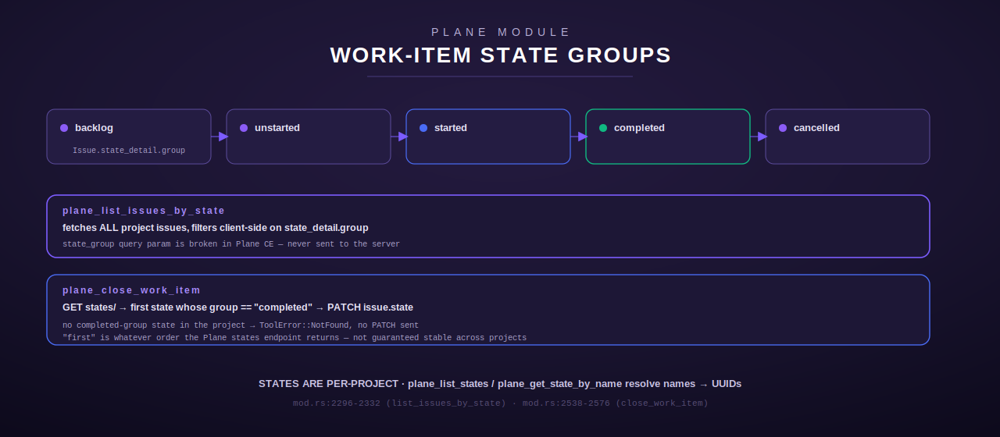

[← Plane overview](README.md) · [← Tool reference](../../README.md)

# Plane — work items (issues)

Work items are Plane CE's "issues" — the core trackable unit. This page covers the 9
CRUD/query tools plus the state/sequence/batch/activity helpers that all operate on the
`projects/{project_id}/issues/...` endpoint family (`Issue`/`ApiList<Issue>` types, `src/plane/types.rs:20-54`).

Every tool here shares the machinery documented on the [overview page](README.md): the optional
`identity` argument (see [Multi-identity](README.md#multi-identity)), `project_id` accepting
either a UUID or a human identifier (see [the UUID gotcha](README.md#the-project-id-uuid-gotcha)),
rate-limited/cached GETs, and uniform HTTP-status-to-`ToolError` mapping.



## Table of contents

- [plane_list_work_items](#plane_list_work_items)
- [plane_get_work_item](#plane_get_work_item)
- [plane_create_work_item](#plane_create_work_item)
- [plane_update_work_item](#plane_update_work_item)
- [plane_delete_work_item](#plane_delete_work_item)
- [plane_list_work_items_filtered](#plane_list_work_items_filtered)
- [plane_list_issues_by_state](#plane_list_issues_by_state)
- [plane_get_issue_by_sequence](#plane_get_issue_by_sequence)
- [plane_batch_create_work_items](#plane_batch_create_work_items)
- [plane_close_work_item](#plane_close_work_item)
- [plane_get_state_by_name](#plane_get_state_by_name)
- [plane_list_recent_activity](#plane_list_recent_activity)

## plane_list_work_items

`mod.rs:1243-1288`. Lists issues in a project.

**Input schema**

| Field | Type | Required | Default | Notes |
| --- | --- | --- | --- | --- |
| `project_id` | string | yes | — | UUID or identifier (e.g. `"LM"`) |
| `limit` | integer | no | 50 | Max results returned; applied client-side after the full list is fetched |
| `identity` | string | no | active default | See [Multi-identity](README.md#multi-identity) |

**Behavior**: GETs `projects/{project_id}/issues/` (cached), parses `ApiList<Issue>`, reports
`total_count()` from the list wrapper vs. the number actually shown (`limit` truncates a
possibly-larger result). Empty list → the plain string `"No work items found"`.

**Output shape**: a human-readable text block, one line per issue:
```
Work items (N shown of TOTAL):
  [<uuid>] #<sequence> <name> (priority: <priority|none>)
  ...
```

**Errors**: `NotFound` if `project_id` doesn't resolve; `Http`/`NotConfigured` per the shared
error table.

**Example**
```json
{"project_id": "LM", "limit": 10}
```
```
Work items (10 shown of 47):
  [4ef3...e9f9] #42 Fix login redirect (priority: high)
  ...
```

## plane_get_work_item

`mod.rs:1292-1333`. Fetches one issue's full detail.

**Input schema**

| Field | Type | Required | Notes |
| --- | --- | --- | --- |
| `project_id` | string | yes | UUID or identifier |
| `issue_id` | string | yes | Issue UUID |
| `identity` | string | no | See [Multi-identity](README.md#multi-identity) |

**Behavior**: GET `projects/{project_id}/issues/{issue_id}/` (cached), parse `Issue`.

**Output shape**:
```
Issue: <name>
ID: <uuid>
Sequence: <n|-> 
Priority: <priority|none>
State: <state|unknown>
Description: <desc|(none)>
```

**Errors**: `NotFound` (404 from Plane), `Http`/`NotConfigured`.

## plane_create_work_item

`mod.rs:1337-1436`. Creates a new issue.

**Input schema**

| Field | Type | Required | Notes |
| --- | --- | --- | --- |
| `project_id` | string | yes | UUID or identifier |
| `name` | string | yes | Issue title |
| `description_html` | string | no | HTML body |
| `state` | string | no | State UUID |
| `priority` | string | no | `urgent`/`high`/`medium`/`low`/`none` |
| `due_date` | string | no | `YYYY-MM-DD` |
| `parent` | string | no | Parent issue UUID (sub-issue) |
| `label_ids` | array\<string\> | no | Label UUIDs to attach |
| `module_id` | string | no | Module UUID to link the new issue into (see below) |
| `identity` | string | no | See [Multi-identity](README.md#multi-identity) |

**Behavior**: POSTs to `projects/{project_id}/issues/` with only the fields present in `args`
(each optional field is conditionally added to the request body, so omitted fields are not sent
as `null`).

**Module linking is a second call.** Plane CE's issue-create endpoint does not accept a module
field directly, so when `module_id` is given, `plane_create_work_item` makes a *second* call
against the module-issues endpoint (`PlaneClient::add_issues_to_module`, `mod.rs:923-945`) after
the issue is created.

**Partial-success handling** (`mod.rs:1410-1431`): if the issue-create call succeeds but the
module-link call then fails, the tool does **not** return a bare error that hides the newly
created issue's id — that would lose the id and invite a caller retry that creates a duplicate
issue. Instead it returns an `Http` error whose message carries the created id and sequence
number and explicitly instructs the caller to link (not recreate) it via
`plane_add_issue_to_module`.

**Output shape** (success, no module or module-link succeeded):
```
Created issue: <name>
ID: <uuid>
Sequence: #<n>
Module: <module_id>   ← only present if module_id was given and linked successfully
```

**Errors**: `InvalidArgument` for missing `name`; `NotFound` for an unresolvable `project_id`;
`Http` for the partial-success module-link failure described above, or any non-2xx from Plane.

**In-crate constructor**: `PlaneCreateWorkItem::new(client)` is `pub(crate)`, used by the Scribe
module (`ScribeReportDiscrepancy`, SCRB-04) to call this tool's `execute()` in-process rather than
through the MCP registry — still the one sanctioned Plane access path, just invoked without a
second round trip.

## plane_update_work_item

`mod.rs:1440-1512`. Patches fields on an existing issue.

**Input schema**

| Field | Type | Required | Notes |
| --- | --- | --- | --- |
| `project_id` | string | yes | UUID or identifier |
| `issue_id` | string | yes | Issue UUID |
| `name` | string | no | New title |
| `description_html` | string | no | New description |
| `state` | string | no | New state UUID |
| `priority` | string | no | New priority |
| `due_date` | string | no | New due date |
| `parent` | string | no | New parent issue UUID |
| `label_ids` | array\<string\> | no | New label UUIDs — **replaces** the existing set, not a merge |
| `module_id` | string | no | Module UUID to add this issue to |
| `identity` | string | no | See [Multi-identity](README.md#multi-identity) |

**Behavior**: builds a PATCH body from whichever scalar fields are present; `label_ids` is
included verbatim if present. A **module-only update is valid** (`mod.rs:1481-1487`): setting
`module_id` alone with no other field is treated as an intentional "move this issue into that
module" operation, not an error — the empty-body check only fires when *neither* a field *nor* a
`module_id` is present. If any scalar field was given, the PATCH is sent first and the issue's new
name is captured for the response; the module link (if requested) is then applied via the same
`add_issues_to_module` helper, after the field PATCH.

**Output shape**:
```
Updated issue: <name|(unchanged)> (ID: <issue_id>) — added to module <module_id>
```
(The `— added to module ...` suffix only appears when `module_id` was given.)

**Errors**: `InvalidArgument` ("No fields to update provided") if neither a field nor `module_id`
is present; otherwise the shared HTTP-status error table. Unlike `plane_create_work_item`, a
module-link failure here propagates as a plain `Http` error (no partial-success id-preservation
wording) — the field PATCH, if any, has already succeeded and is not rolled back.

## plane_delete_work_item

`mod.rs:1516-1548`. Permanently deletes an issue.

**Input schema**

| Field | Type | Required | Notes |
| --- | --- | --- | --- |
| `project_id` | string | yes | UUID or identifier |
| `issue_id` | string | yes | Issue UUID to delete |
| `identity` | string | no | See [Multi-identity](README.md#multi-identity) |

**Behavior**: DELETE `projects/{project_id}/issues/{issue_id}/`. No confirmation step, no
soft-delete — this is Plane's permanent delete endpoint.

**Output shape**: `"Deleted work item <issue_id>"`.

**Errors**: `NotFound`, `Http`/`NotConfigured` per the shared table.

## plane_list_work_items_filtered

`mod.rs:2391-2461`. Lists issues filtered by priority and/or label, client-side.

**Input schema**

| Field | Type | Required | Default | Notes |
| --- | --- | --- | --- | --- |
| `project_id` | string | yes | — | UUID or identifier |
| `priority` | string | no | (no filter) | Case-insensitive exact match against the issue's priority (`none` matches an unset priority) |
| `label_id` | string | no | (no filter) | Must appear in the issue's `label_ids` |
| `limit` | integer | no | 50 | Applied after filtering |
| `identity` | string | no | active default | |

**Behavior**: fetches **all** project issues (one cached GET), then filters in-process — both
filters, when given, must match (AND). This is the same "fetch-all, filter client-side" pattern
used by `plane_list_issues_by_state` and `plane_get_issue_by_sequence` (Plane CE's own
query-parameter filtering on this endpoint is not relied on).

**Output shape**: `"No work items match the given filters"` if empty, else the same
`[<uuid>] <name> (priority: <priority>)` line format as `plane_list_work_items`.

**In-crate constructor**: `PlaneListWorkItemsFiltered::new(client)` is `pub(crate)`, same
rationale as `PlaneCreateWorkItem::new`.

## plane_list_issues_by_state

`mod.rs:2273-2332`. Lists issues in one state *group* (not a specific named state).

**Input schema**

| Field | Type | Required | Default | Notes |
| --- | --- | --- | --- | --- |
| `project_id` | string | yes | — | UUID or identifier |
| `state_group` | string (enum) | yes | — | One of `backlog`, `unstarted`, `started`, `completed`, `cancelled` |
| `limit` | integer | no | 50 | |
| `identity` | string | no | active default | |

**Behavior**: fetches all issues, filters on `issue.state_detail.group` (case-insensitive) —
**not** a server-side query. The code comment is explicit about why: *"state_group query param is
broken in Plane CE"* (`mod.rs:2303`). An issue with no `state_detail` never matches any group.

**Output shape**: `"No issues in state group '<group>'"` if empty, else
`Issues in '<group>' (N):` followed by `[<uuid>] <name>` lines.

## plane_get_issue_by_sequence

`mod.rs:2336-2387`. Resolves a human-readable sequence number (the numeric part of `LM-42`) to
its full issue.

**Input schema**

| Field | Type | Required | Notes |
| --- | --- | --- | --- |
| `project_id` | string | yes | UUID or identifier |
| `sequence_id` | integer | yes | The numeric part of e.g. `LM-42` → `42` |
| `identity` | string | no | See [Multi-identity](README.md#multi-identity) |

**Behavior**: fetches all issues and linear-scans for `sequence_id == Some(sequence_id)` — Plane
CE has no direct by-sequence lookup endpoint, so this is a full-list fetch (served from cache
within the TTL) plus client-side match.

**Output shape**:
```
Issue #<seq>: <name>
ID: <uuid>
Priority: <priority|none>
State: <state|unknown>
```

**Errors**: `NotFound` ("No issue with sequence_id #N") if no match.

## plane_batch_create_work_items

`mod.rs:2623-2708`. Creates multiple issues sequentially in one call.

**Input schema**

| Field | Type | Required | Notes |
| --- | --- | --- | --- |
| `project_id` | string | yes | UUID or identifier |
| `items` | array\<object\> | yes | Must be non-empty. Each item: `name` (string, required), `description_html`, `priority`, `state` (all optional strings) |
| `identity` | string | no | See [Multi-identity](README.md#multi-identity) |

**Behavior**: resolves `project_id` once, then issues one POST per item **sequentially** (not
concurrently — each POST still passes through the shared rate limiter, so a large batch is paced
like any other calls). Each item's `name` is validated individually with the item's index in the
error message (`items[N] missing required field: name`) before any network call for that item.
There is **no all-or-nothing transaction**: a failure partway through leaves earlier items
created and later items un-attempted — the tool returns the error from the failing item's POST,
and the caller must inspect what was already created (there is no automatic rollback of prior
successful creates in the batch).

**Output shape** (on full success):
```
Batch-created N issue(s):
  1/N: [<uuid>] <name> (#<sequence>)
  2/N: [<uuid>] <name> (#<sequence>)
  ...
```

**Errors**: `InvalidArgument` if `items` is missing/empty or an item lacks `name`; otherwise the
shared HTTP error table, surfaced as soon as one item's POST fails (stopping the batch there).

## plane_close_work_item

`mod.rs:2518-2576`. Moves an issue to the first available `completed`-group state.

**Input schema**

| Field | Type | Required | Notes |
| --- | --- | --- | --- |
| `project_id` | string | yes | UUID or identifier |
| `issue_id` | string | yes | Issue UUID to close |
| `identity` | string | no | See [Multi-identity](README.md#multi-identity) |

**Behavior**: GETs the project's states (cached), finds the first `State` whose `group` is
`"completed"` (case-insensitive), then PATCHes the issue's `state` field to that state's UUID. If
no `completed`-group state exists in the project, no PATCH is sent. "First" is whatever order the
Plane states endpoint returns — not asserted to be stable or meaningful (e.g. not necessarily the
project's canonical "Done" state if it has more than one completed-group state).

**Output shape**: `"Closed work item: <name> (now in state '<state name>')"`.

**Errors**: `NotFound` ("No 'completed' state found in this project") if the project has no
completed-group state; otherwise the shared HTTP error table.

## plane_get_state_by_name

`mod.rs:2580-2619`. Resolves a workflow state's human name to its UUID.

**Input schema**

| Field | Type | Required | Notes |
| --- | --- | --- | --- |
| `project_id` | string | yes | UUID or identifier |
| `name` | string | yes | Case-insensitive exact match, e.g. `"Backlog"`, `"Done"` |
| `identity` | string | no | See [Multi-identity](README.md#multi-identity) |

**Behavior**: GETs project states (cached), linear-scans for `name.eq_ignore_ascii_case`.

**Output shape**: `"State '<name>': <uuid>"`.

**Errors**: `NotFound` ("No state named '<name>' in this project") on no match. This is the tool
to call before passing a `state` UUID into `plane_create_work_item`/`plane_update_work_item`.

## plane_list_recent_activity

`mod.rs:2465-2514`. Lists audit/activity events for one issue.

**Input schema**

| Field | Type | Required | Default | Notes |
| --- | --- | --- | --- | --- |
| `project_id` | string | yes | — | UUID or identifier |
| `issue_id` | string | yes | — | Issue UUID |
| `limit` | integer | no | 20 | |
| `identity` | string | no | active default | |

**Behavior**: GETs `projects/{project_id}/issues/{issue_id}/activities/` (cached), parses
`ApiList<Activity>` (`types.rs:159-176`), truncates to `limit`.

**Output shape**: `"No recent activity"` if empty, else `Recent activity (N):` followed by
`  <actor> <verb> <field>` lines (actor defaults to `"unknown"`, verb to `"updated"`, field can be
blank).
