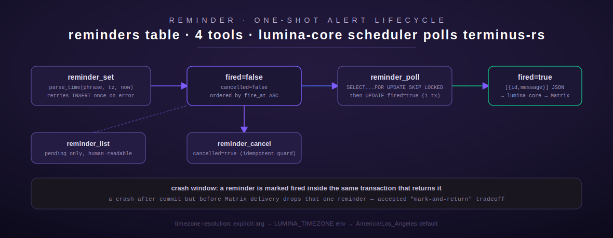

# reminder

[← project-planning index](README.md) | [← docs index](../../README.md)

Reminder is the one-shot scheduled-alert system: an agent sets a reminder in
natural language ("in 30 minutes", "tomorrow at 9am"), it is parsed to a UTC
instant and stored, and lumina-core's own 60-second scheduler polls
`reminder_poll` and delivers due reminders over Matrix. Four tools plus a
dedicated natural-language time parser. Source:
[`src/reminder/mod.rs`](../../../src/reminder/mod.rs) and
[`src/reminder/parse.rs`](../../../src/reminder/parse.rs).



## Overview

**Database ownership lives entirely in terminus-rs** (`src/reminder/mod.rs:10-12`)
— lumina-core holds the Matrix connection and calls `reminder_poll` over the
Chord proxy on its own 60-second cadence; it never touches Postgres directly.
The table (created out-of-band) is documented in the module doc comment
(`src/reminder/mod.rs:16-19`):

```sql
CREATE TABLE IF NOT EXISTS reminders (
  id TEXT PRIMARY KEY, user_id TEXT, message TEXT NOT NULL,
  fire_at TIMESTAMPTZ NOT NULL, created_at TIMESTAMPTZ NOT NULL DEFAULT now(),
  fired BOOLEAN NOT NULL DEFAULT false, cancelled BOOLEAN NOT NULL DEFAULT false);
```

`get_pool()` (`src/reminder/mod.rs:48-57`) is the same fresh-connection-per-call
pattern used across the Postgres-backed modules in this domain, reading
`DATABASE_URL`.

**Env vars:** `DATABASE_URL` (Postgres), `LUMINA_TIMEZONE` (optional IANA
timezone name, e.g. `America/New_York`; default `America/Los_Angeles` if
unset and no explicit `timezone` argument is given — `resolve_timezone()`,
`src/reminder/mod.rs:61-68`).

**Auth / gating:** none — all four tools are ungated. `reminder_poll` is
documented as internal/scheduler-only in its own description
("Used by the lumina-core scheduler — not for direct user use") but this is
advisory only; nothing in the tool itself restricts who can call it.

## Tool: `reminder_set`

**Purpose:** create a new one-shot reminder from a natural-language time
phrase. Source: `src/reminder/mod.rs:74-151`.

| Field | Type | Required | Default |
| --- | --- | --- | --- |
| `message` | string | yes | — |
| `time` | string (natural language) | yes | — |
| `timezone` | string (IANA name) | no | `LUMINA_TIMEZONE` env, else `America/Los_Angeles` |

**Behavior:**
1. Resolves the effective timezone (`resolve_timezone`), rejecting an
   unparseable timezone name with `InvalidArgument("unknown timezone
   '{name}'")`.
2. Parses `time` via [`parse_time`](#natural-language-time-parsing-parsetime)
   against the current instant. A phrase the parser cannot understand
   produces `InvalidArgument("could not understand time '{phrase}': {err}")`
   — parse failures never reach the database.
3. Mints a fresh UUIDv4 as the reminder id and inserts
   `(id, message, fire_at)` — **`user_id` is never set** despite being a
   column in the schema comment; every row currently written leaves
   `user_id` null, so `reminder_list`/`reminder_cancel` are effectively
   global/single-tenant, not scoped per user.
4. **Retries once on a transient DB error** before failing
   (`src/reminder/mod.rs:115-138`): if the first `INSERT` attempt errors, it
   sleeps 500ms and retries with the *same* pre-minted UUID. This is safe to
   retry because the UUID is fixed before either attempt — a duplicate-key
   conflict on retry would mean the first attempt actually succeeded
   despite reporting an error, not a double-write of two different rows.
   This exists specifically to avoid the "tool said it failed but it
   actually persisted" ambiguity the code comment calls out as observed in
   live testing.
5. On success, formats a confirmation echoing the parsed time back in the
   caller's timezone, so the model can confidently state what was actually
   scheduled rather than repeating the raw input phrase.

**Output shape:** plain text —
```
✅ Reminder created (id={uuid}). I'll remind you "{message}" on {weekday Month D at H:MM AM/PM} ({tz name}).
```

**Errors:** `InvalidArgument` (missing fields, bad timezone, unparseable
time), `NotConfigured` (`DATABASE_URL` unset), `Database` (insert failure
after the one retry).

**Worked example:**

```json
{"message": "check the S110 docs build", "time": "in 45 minutes"}
```
```
✅ Reminder created (id=7e2f...). I'll remind you "check the S110 docs build" on Friday July 10 at 2:45 PM (America/Los_Angeles).
```

## Tool: `reminder_list`

**Purpose:** list all pending (not fired, not cancelled) reminders,
soonest-first. Source: `src/reminder/mod.rs:157-199`. No input fields.

**Behavior:** `SELECT id, message, fire_at FROM reminders WHERE fired =
false AND cancelled = false ORDER BY fire_at ASC` — every pending reminder
in the table, with no `user_id` filter (consistent with `reminder_set` never
populating `user_id`). Falls back to `America/Los_Angeles` if
`LUMINA_TIMEZONE` is unset or invalid for display purposes
(`.unwrap_or(chrono_tz::America::Los_Angeles)`, `src/reminder/mod.rs:188`) —
note this fallback silently swallows a *set-but-invalid*
`LUMINA_TIMEZONE`, unlike `reminder_set`'s explicit `timezone` argument
which surfaces bad values as `InvalidArgument`.

**Output:** `"No pending reminders."` if empty, else `"{N} pending
reminder(s):"` header then `"[id={id}] {weekday Month D at H:MM AM/PM} —
{message}"` per line.

## Tool: `reminder_cancel`

**Purpose:** cancel a pending reminder. Source: `src/reminder/mod.rs:205-248`.

| Field | Type | Required | Default |
| --- | --- | --- | --- |
| `reminder_id` | string | yes | — |

**Behavior:** `UPDATE reminders SET cancelled = true WHERE id = $1 AND fired
= false AND cancelled = false` — idempotency guard: a reminder that already
fired or was already cancelled cannot be "cancelled" again. Zero rows
affected → `NotFound("Reminder id={reminder_id} not found, already fired, or
already cancelled")` (the same three-way merged-error pattern seen in axon
and nexus).

**Output:** `"Reminder id={reminder_id} cancelled"`.

## Tool: `reminder_poll`

**Purpose:** internal — atomically claim every currently-due reminder and
mark it fired, for the lumina-core scheduler to deliver. Source:
`src/reminder/mod.rs:254-309`. No input fields.

**Behavior:** runs inside a single transaction:
1. `SELECT id, message FROM reminders WHERE fire_at <= now() AND fired =
   false AND cancelled = false ORDER BY fire_at ASC FOR UPDATE SKIP LOCKED`
   — `FOR UPDATE SKIP LOCKED` means concurrent pollers (if more than one
   process calls this at once) never block on each other or double-claim
   the same row; a locked row is simply skipped by the other poller.
2. If any rows were claimed, `UPDATE reminders SET fired = true WHERE id =
   ANY($1)` for exactly those ids, in the same transaction.
3. Commits.
4. Returns the claimed set as a JSON array of `{"id": ..., "message":
   ...}` objects — **serialized as a string**, since `execute()`'s return
   type is `String`, not `Value`; callers must `serde_json::from_str` the
   result themselves.

**Documented crash window** (`src/reminder/mod.rs:22-28`): a reminder is
marked `fired = true` inside the *same* transaction that returns it to the
caller. If the process crashes after that transaction commits but before
the scheduler actually delivers the Matrix message, that one reminder is
silently dropped — it will never be returned by a future poll since it's
already `fired`. This is an explicit, accepted "mark-and-return" tradeoff
for a best-effort one-shot alert system, not a bug.

**Output shape:** JSON string, e.g. `"[{\"id\":\"7e2f...\",\"message\":\"check
the S110 docs build\"}]"`, or `"[]"` when nothing is due.

## Natural-language time parsing (`parse_time`)

Source: [`src/reminder/parse.rs`](../../../src/reminder/parse.rs). The public
entry point is
`parse_time(phrase: &str, tz: Tz, now_utc: DateTime<Utc>) -> Result<DateTime<Utc>, ParseError>`
(`parse.rs:38`) — pure and deterministic (the caller supplies "now", so tests
pin the clock; production callers pass `Utc::now()`).

**Resolution order** (first matching branch wins, `parse.rs:44-101`):

1. **Relative** — `"in N <unit>"` (`in 30 minutes`, `in 2 hours`, `in 45
   seconds`, `in 1 day`, `in 1 week`). Units: `second(s)/sec(s)/s`,
   `minute(s)/min(s)/m`, `hour(s)/hr(s)/h`, `day(s)/d`, `week(s)/wk(s)`.
   Negative amounts are rejected (`ParseError`). Computed directly off
   `now_utc`, timezone-independent.
2. **Named instants** — `noon`, `midnight` (resolve to 12:00/00:00 local,
   rolling to tomorrow if already past), `this evening`/`tonight` alone
   (defaults to 20:00 local).
3. **`tomorrow [at] <clock>`** — bare `"tomorrow"` defaults to 9:00am;
   `"tomorrow at 9am"` / `"tomorrow 9am"` (the `at` is optional) parse the
   trailing clock.
4. **`tonight at <clock>` / `this evening at <clock>`** — uses
   [evening-context clock parsing](#clock-parsing) (see below): a bare
   hour with no am/pm marker is read as PM.
5. **Weekday** — `"[next] <weekday> [at] <clock>"` (`parse_weekday`,
   `parse.rs:276-316`). Bare weekday defaults to 9:00am. `next` forces the
   target at least 7 days out even if today happens to be that weekday;
   without `next`, a same-week match whose clock time has already passed
   today rolls forward exactly one week (not to next month/next
   occurrence-after-next).
6. **Explicit month/day** — `"<month> <day> [at] <clock>"`
   (`parse_month_day`, `parse.rs:332-370`), e.g. `"june 15 at 6:00 am"`.
   Ordinal suffixes are stripped from the day (`"15th"` → `15`). If the
   resulting date (at the current year) has already passed, it rolls to
   the same month/day **next year**, not an error.
7. **Absolute-today clock** — the fallback: `"at 3pm"`, `"3pm"`, `"15:00"`,
   `"8:30 pm"`. If the resolved time is `<= now`, rolls to tomorrow's same
   clock time.

### Clock parsing

`parse_clock` (`parse.rs:134-198`) accepts `"3pm"`, `"3 pm"`, `"8:30pm"`,
`"8:30 PM"`, `"15:00"`, `"9"`, `"9am"`, and single-letter `a`/`p` suffixes.
`12pm` stays `12` (noon); `12am` becomes `0` (midnight); a 24-hour value
`> 23` or a 12-hour value `> 12` is rejected. `parse_clock_evening`
(`parse.rs:203-215`) wraps it: a bare hour `1`–`11` **with no am/pm marker**
is reinterpreted as PM — this is what makes `"tonight at 8"` mean 20:00
rather than 08:00, while an explicit `"tonight at 8am"` is still honored
literally.

### DST handling

`assemble()` (`parse.rs:235-273`) builds the final UTC instant from a local
date + clock and explicitly handles both DST edge cases via
`chrono::LocalResult`:
- **Ambiguous** (fall-back fold, a local time that occurs twice) — picks
  the earlier occurrence.
- **None** (spring-forward gap, a local time that never occurs) — bumps the
  hour by one and retries that same day; if still unresolvable, returns
  `ParseError("unresolvable local time (DST)")`.

`roll_if_past` then advances by one day in a loop until the result is
strictly after `now_utc`, when the caller requested that behavior (most
callers do; explicit month/day and weekday resolution instead roll by a
year or a week respectively, handled in their own functions).

### Errors

`ParseError(String)` wraps every failure mode: empty phrase, unknown
relative unit, non-numeric relative amount, negative relative amount, bad
clock string, out-of-range hour/minute, unresolvable DST, invalid explicit
date. `reminder_set` converts any `ParseError` into
`ToolError::InvalidArgument`.

**Worked parsing examples** (from the module's own test suite, `parse.rs:412-534`,
using a fixed reference "now" of Friday 2026-06-12 15:00 PDT):

| Phrase | Result |
| --- | --- |
| `"in 30 minutes"` | now + 30 minutes |
| `"at 3pm"` | today's 3pm already passed (now is 3pm) → tomorrow 3pm |
| `"at 5pm"` | today 5pm (still future) |
| `"tonight at 8"` | today 20:00 (evening-context bare hour) |
| `"next Monday at 10am"` | 2026-06-15 10:00 (Friday → next Monday) |
| `"saturday at 10am"` | 2026-06-13 10:00 (tomorrow, same week) |
| `"next friday at 9am"` | 2026-06-19 09:00 (`next` forces +7 days) |
| `"january 5 at 8am"` | rolls to 2027 (Jan 5 2026 already passed) |
| `"june 15th at 6am"` | ordinal suffix stripped, same as `"june 15"` |

## Registration

`pub fn register(registry: &mut ToolRegistry)` (`src/reminder/mod.rs:315-320`)
registers all four tools via `register_or_replace`.

[← project-planning index](README.md) | [← docs index](../../README.md)
