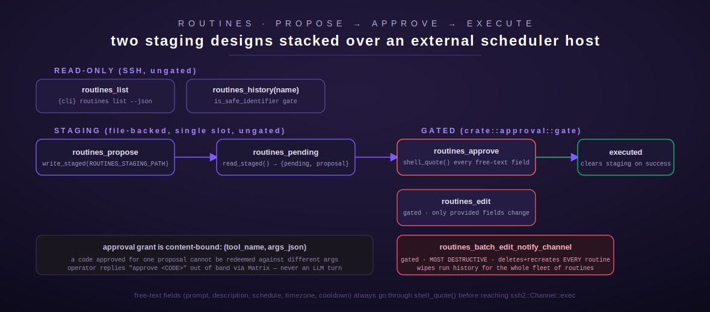

# routines

[← project-planning index](README.md) | [← docs index](../../README.md)

Routines gives an agent control over a set of named, cron-like scheduled
prompts owned by an **external scheduler service** — reachable only over
SSH, never in-process. This is a Rust port of a prior Python tool set; three
of its seven tools mutate a live scheduler and are guarded behind the same
human-approval gate used by `ansible`/`openhands`. Source:
[`src/routines/mod.rs`](../../../src/routines/mod.rs).



## Overview

**Everything in this module is SSH, not a local database.** `RoutinesConfig`
(`src/routines/mod.rs:117-154`) is built entirely from environment variables
— no compiled-in host, user, key path, or CLI binary name (a deliberate PII
remediation: the module doc comment notes the CLI name previously had a
compiled-in fallback and no longer does). `require_cli()` fails clean with
`NotConfigured("ROUTINES_CLI is not set")` if `ROUTINES_CLI` is unset, rather
than silently substituting a real binary name.

**Env vars:**

| Var | Purpose | Default |
| --- | --- | --- |
| `ROUTINES_SSH_HOST` | SSH host of the external scheduler | none (required) |
| `ROUTINES_SSH_USER` | SSH user | `"root"` |
| `ROUTINES_SSH_KEY_PATH` | path to the SSH private key file | none (required) |
| `ROUTINES_CLI` | name of the remote scheduler CLI binary invoked over SSH | none (required, no fallback) |
| `ROUTINES_STAGING_PATH` | local path for the single-slot proposal staging file | `/var/lib/terminus/routines_staging.json` |

**What was verified live vs. inferred** (documented candidly in the module's
own doc comment, `src/routines/mod.rs:23-44`): the tool names, JSON Schemas,
and `routines_pending`'s exact response shape were pulled from the live
scheduler host's MCP endpoint. `routines_list`/`routines_history` were
exercised live too, but failed with an SSH "no route to host" error at port
time — which at least confirmed both are SSH-backed and gave the observed
`{"error": ...}` failure shape to mirror. The *exact* remote CLI command
syntax for `create`/`update`/`delete`/`edit`/`batch-edit-notify-channel`
could not be read from source (no filesystem access to that host during the
port) and is flagged in the source as "a reasonable, clearly-flagged
inference, not a verified fact," pending operator confirmation.

## Security model — two staging designs stacked

1. **Propose/pending staging** is a single-slot, file-backed mechanism
   (`ROUTINES_STAGING_PATH`) mirroring the ported system's own design: one
   proposal at a time, overwritten by the next `routines_propose` call.
   Proposing and checking a proposal (`routines_propose`, `routines_pending`)
   are **not gated** — only *executing* one is considered dangerous.
2. **Execution gating** — `routines_approve`, `routines_edit`, and
   `routines_batch_edit_notify_channel` all call `crate::approval::gate`
   (see [`architecture` docs](../../architecture/) / the approval gate is
   shared with `ansible` and `openhands`) before doing anything else. A
   grant is content-bound: it is scoped to `(tool_name, args_json)`, so a
   code approved for one staged proposal (or one set of arguments) cannot
   later be redeemed against different arguments — this closes a real gap
   found in adversarial review, where the single-slot staging file could be
   overwritten between approval and redemption. The operator approves out
   of band (a deterministic `approve <CODE>` chat command, never an LLM
   turn); the model itself can never grant its own approval.

**Shell-injection defense:** free-text fields (`schedule`, `timezone`,
`description`, `prompt`, `cooldown`) are LLM-authored text that gets
interpolated into a remote SSH command string. An earlier version used
Rust's `{:?}` (Debug) formatting, which only escapes `"`/`\` and leaves
`$(...)`, backticks, and bare `$VAR` live for the remote shell to expand —
found by a correctness review and fixed by routing every free-text field
through [`shell_quote`](#shell_quote) (POSIX single-quoting). `name`/
`channel` — which become directory-like identifiers, not free text — go
through the stricter [`is_safe_identifier`](#is_safe_identifier) allowlist
instead.

### `shell_quote`

`fn shell_quote(s: &str) -> String` (`src/routines/mod.rs:212-224`) wraps a
string in POSIX single quotes; an embedded `'` is closed, escaped, and
reopened (`it's` → `'it'\''s'`). Nothing inside single quotes is ever
expanded by a POSIX shell, unconditionally neutralizing command
substitution and variable expansion.

### `is_safe_identifier`

`fn is_safe_identifier(s: &str) -> bool` (`src/routines/mod.rs:192-197`)
allows only ASCII alphanumerics, `-`, `_`, `.`, non-empty, max 200 chars.
Applied to routine `name` (in `routines_history`, `routines_approve`,
`routines_edit`) and `channel` (in `routines_batch_edit_notify_channel`)
**before** those values are interpolated into a command string — rejection
returns a JSON `{"error": ...}` payload without attempting any SSH call.

## Tool: `routines_list`

**Purpose:** list every scheduler routine with schedule, status, next fire
time, run count. Source: `src/routines/mod.rs:325-349`. No input fields.

**Behavior:** runs `{ROUTINES_CLI} routines list --json` over SSH
(30s timeout) and returns the parsed JSON stdout as-is (or a `{"raw":
...}` wrapper if stdout wasn't valid JSON, or `{"error": ...}` on any SSH/
non-zero-exit failure). **Ungated.**

**Output shape:** raw JSON string from the remote CLI, or an error object.

## Tool: `routines_history`

**Purpose:** recent run history for one named routine. Source:
`src/routines/mod.rs:355-407`.

| Field | Type | Required | Default |
| --- | --- | --- | --- |
| `name` | string | yes | — |
| `limit` | integer | no | `10` |

**Behavior:** `name` is checked against `is_safe_identifier` first — an
invalid name short-circuits to `{"error": "Invalid routine name: only
letters, digits, '-', '_', '.' are allowed", "name": <name>}` without an
SSH attempt. `limit` is clamped `1..=1000` (looser than the other modules'
typical `1..=100`). Runs `{ROUTINES_CLI} routines history {name} --limit
{limit} --json`; on any error response, the requested `name` is merged into
the error object (matching observed live behavior).

## Tool: `routines_propose`

**Purpose:** stage a proposed routine change for operator approval — does
**not** execute anything. Source: `src/routines/mod.rs:413-468`.

| Field | Type | Required | Default |
| --- | --- | --- | --- |
| `name` | string | yes | — |
| `schedule` | string | yes | — |
| `timezone` | string | yes | — |
| `description` | string | yes | — |
| `prompt` | string | yes | — |
| `action` | string | no | `"create"` (also accepts `"update"`, `"delete"`) |

**Behavior:** builds a `RoutineProposal { action, name, schedule, timezone,
description, prompt, status: "pending_approval" }` and writes it to
`ROUTINES_STAGING_PATH` as pretty-printed JSON, **replacing any prior
proposal** (single slot — there is no queue of pending proposals). **Not
gated** — proposing is considered safe; only `routines_approve` executing it
is dangerous.

**Output shape:** JSON — `{"saved": true, "message": "Proposal saved. ...
must approve before routines_approve is called.", "proposal": {...}}`.

## Tool: `routines_pending`

**Purpose:** read-only check for a staged proposal. Source:
`src/routines/mod.rs:474-498`. No input fields.

**Behavior:** reads and JSON-parses the staging file, if present.

**Output shape:** `{"pending": false}` if no file/parse failure, or
`{"pending": true, "proposal": {...}}`.

## Tool: `routines_approve`

**Purpose:** execute the currently staged proposal. **Guarded.** Source:
`src/routines/mod.rs:504-590`. No input fields beyond the implicit
`_approval_code` used by the gate.

**Behavior:**
1. Reads the staged proposal; if none exists, returns `{"executed": false,
   "error": "No pending routine proposal to approve."}` **before** even
   reaching the approval gate (nothing to approve, nothing to gate).
2. Builds a human-readable summary (`"{action} routine '{name}' (schedule=
   '{schedule}', tz='{timezone}') via the scheduler"`) and calls
   `gate("routines_approve", {"_approval_code": ..., "proposal": &proposal},
   &summary)`. The gate keys the grant on the *entire staged proposal*, not
   just a blank "any approve call" check — a code granted for one proposal
   cannot execute a different one substituted into the staging slot in the
   meantime.
3. On `Gate::Pending`/`Gate::Denied`, returns that message directly as the
   tool result — no staging mutation, no SSH call happens.
4. On `Gate::Granted`, validates the proposal's `name` against
   `is_safe_identifier` (a staged proposal with an unsafe name is refused
   even after approval — defense in depth).
5. Builds the remote command per `action`:
   - `create`/`update`: `{cli} routines {action} {name} --schedule
     {shell_quote(schedule)} --timezone {shell_quote(timezone)}
     --description {shell_quote(description)} --prompt
     {shell_quote(prompt)} --json`
   - `delete`: `{cli} routines delete {name} --json` (no free-text fields
     to quote)
   - any other `action` value: refused with `{"executed": false, "error":
     "Unknown proposal action '{action}'"}`.
6. Runs the command (60s timeout). On success (`result` has no `"error"`
   key), clears the staging file.

**Output shape:** `{"executed": bool, "result": <remote JSON or error
object>}` (or the two early-exit shapes above).

## Tool: `routines_edit`

**Purpose:** edit an existing routine in place — only provided fields
change, run history is preserved. **Guarded.** Source:
`src/routines/mod.rs:596-659`.

| Field | Type | Required | Default |
| --- | --- | --- | --- |
| `name` | string | yes | — |
| `schedule` | string | no | `""` (empty = unchanged) |
| `prompt` | string | no | `""` |
| `description` | string | no | `""` |
| `timezone` | string | no | `""` |
| `cooldown` | string | no | `""` |

**Behavior:** gates on `("routines_edit", args, "Edit routine '{name}' on
the scheduler")` — note the gate content-binds on the **raw args as
supplied**, including whichever optional fields were actually sent, so a
grant for one combination of edited fields cannot be replayed with
different field values. After a granted gate, validates `name` via
`is_safe_identifier`, then builds `{cli} routines edit {name}` and appends
`--{field} {shell_quote(value)}` for each of the five optional fields that
is present *and* non-empty (an explicitly-empty-string field is treated the
same as "not provided" — there is no way to clear a field to empty via this
tool).

**Output shape:** raw JSON from the remote CLI, or `{"error": ...}`.

## Tool: `routines_batch_edit_notify_channel`

**Purpose:** the single most destructive tool in this module — switches
**every** routine's notify-channel by deleting and recreating each one,
because the scheduler's own edit command doesn't support changing that
field. **Guarded**, with an explicit `"DESTRUCTIVE"`-prefixed summary shown
to the approving operator. Source: `src/routines/mod.rs:665-715`.

| Field | Type | Required | Default |
| --- | --- | --- | --- |
| `channel` | string | no | `"gateway"` |

**Behavior:** gates first — the module's own comment is explicit that "No
SSH call, no destructive action of any kind happens above this line;
`Gate::Granted` is the only path that reaches the code below." Summary
shown to the operator: `"DESTRUCTIVE: delete+recreate EVERY routine on the
scheduler to switch notify-channel to '{channel}' (wipes all run
history)"`. After grant, validates `channel` via `is_safe_identifier`, then
runs `{cli} routines batch-edit-notify-channel --channel {channel} --json`
with a 120-second timeout (longest of any tool in this module, reflecting
the bulk delete+recreate work).

**Output shape:** raw JSON from the remote CLI, or `{"error": ...}`.

**Worked example — propose then approve:**

```json
// 1. routines_propose
{"name": "morning-briefing", "schedule": "0 7 * * *", "timezone": "America/New_York",
 "description": "Daily briefing", "prompt": "Summarize overnight events", "action": "create"}
// → {"saved": true, "message": "Proposal saved. ...", "proposal": {...}}

// 2. routines_pending (operator reviews)
{}
// → {"pending": true, "proposal": {"name": "morning-briefing", ...}}

// 3. routines_approve — first call, no code yet
{}
// → Gate::Pending: "⚠️ APPROVAL REQUIRED — `routines_approve` is a guarded tool and was NOT run. ..."

// 4. operator replies "approve <CODE>" out of band; routines_approve is re-dispatched with the code
{"_approval_code": "AB3F9K"}
// → {"executed": true, "result": {...remote CLI JSON...}}
```

## Registration

`pub fn register(registry: &mut ToolRegistry)` (`src/routines/mod.rs:721-739`)
builds one shared `Arc<RoutinesConfig>` and registers all seven tools via
`registry.register(...)`, logging (not panicking) on any registration
failure.

[← project-planning index](README.md) | [← docs index](../../README.md)
