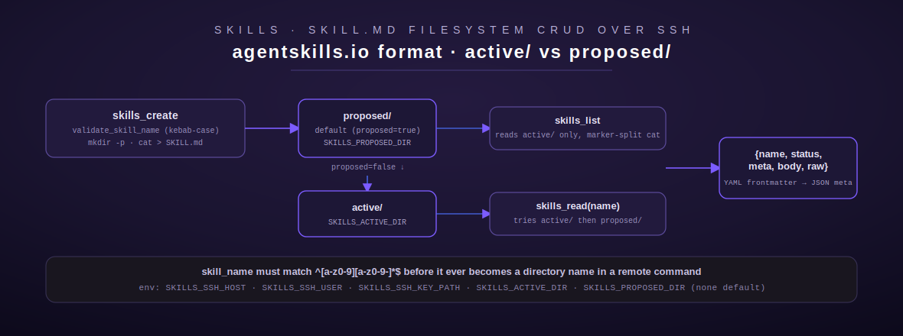

# skills

[← project-planning index](README.md) | [← docs index](../../README.md)

Skills is filesystem CRUD over a fleet host's `active/`/`proposed/` skill
directories, in [agentskills.io](https://agentskills.io) markdown format
(YAML frontmatter + Markdown body). Three tools: list, read, create. This is
a Rust port of a prior Python tool set, reached entirely over SSH since
Terminus itself does not run on the fleet host. Source:
[`src/skills/mod.rs`](../../../src/skills/mod.rs).



## Overview

**Skill files live in one of two directories** on the fleet host:
`active/` (approved, live skills) and `proposed/` (staged for review) — the
same propose/approve *shape* as `routines`, but here it is a filesystem
convention rather than a database/staging-file mechanism, and there is no
approval gate or `crate::approval` involvement anywhere in this module (a
`skills_create proposed=false` write straight to `active/` happens
immediately, with no operator sign-off step).

**What was verified live at port time** (`src/skills/mod.rs:1-20`):
`skills_create` (default `proposed=true`) returned a path under
`proposed/<name>/SKILL.md`; `skills_list` reads `active/` and returned
`{"count": 0, "skills": []}` on an empty live server; `skills_read` on a
name that only existed in `proposed/` still found it (checks `active/`
first, falls back to `proposed/`), returning `{"name", "status", "meta",
"body", "raw"}` where `meta` is the parsed YAML frontmatter (`agent`,
`description`, `license: MIT`, `name`, `tags: [...]`, `version: '1.0'`) and
`body`/`raw` are the Markdown-after-frontmatter and full file text
respectively; `skills_read` on a missing name returned an `{"error": ...}`
payload as a *successful* MCP call (`isError: false`), not a transport-level
error — this module's `skills_read` mirrors that shape.

**Env vars:**

| Var | Purpose | Default |
| --- | --- | --- |
| `SKILLS_SSH_HOST` | SSH host of the fleet box | none (required) |
| `SKILLS_SSH_USER` | SSH user | `"root"` |
| `SKILLS_SSH_KEY_PATH` | path to the SSH private key file | none (required) |
| `SKILLS_ACTIVE_DIR` | directory holding approved/live skills | none (required, no compiled-in fallback — PII remediation 2026-07) |
| `SKILLS_PROPOSED_DIR` | directory holding skills pending review | none (required, no compiled-in fallback — PII remediation 2026-07) |

**Auth / gating:** no `crate::approval::gate` involvement. The security
model is entirely input-validation-based:

- `skill_name` must match `^[a-z0-9][a-z0-9-]*$` — kebab-case, lowercase
  letters/digits/hyphens only, checked by `validate_skill_name()`
  (`src/skills/mod.rs:80-99`) before it is ever placed into a remote path or
  command. This blocks path traversal (`..`, `/`) and shell metacharacters
  outright, since `skill_name` becomes a directory name on the remote host.
  Note the module comment observes the ported Python docstring said
  "kebab-case" but the *live* server did not appear to enforce it — this
  Rust port adds the enforcement rather than only documenting the
  convention.
- All remote paths are built from the fixed `active_dir`/`proposed_dir`
  roots plus the validated `skill_name` — no other caller-controlled path
  segment is ever accepted.
- Error messages returned to the caller are deliberately generic
  ("The fleet server is unreachable.", "Could not connect to the fleet
  server.") — the real error (host, key path, underlying `ssh2` error) is
  only logged via `tracing::warn!`, not returned in the tool result, so a
  caller cannot fingerprint the fleet host's SSH configuration from tool
  responses.

## SSH transport

Two helper functions do all the SSH work, both synchronous (the `ssh2` crate
is blocking) and wrapped in `tokio::task::spawn_blocking` for async callers:

- `ssh_exec()` (`src/skills/mod.rs:170-225`) — connect, handshake, pubkey
  auth, exec a command, read stdout, return `(output, exit_status)`.
- `ssh_write_stdin()` (`src/skills/mod.rs:585-634`) — same connection setup,
  but writes a payload to the remote command's stdin and sends EOF before
  reading output; used by `skills_create` to pipe SKILL.md content into
  `cat > <path>` without a separate upload step.

Both authenticate via `sess.userauth_pubkey_file(&ssh_user, None,
key_path.as_ref(), None)` — key-based auth only, no password path exists.

## Tool: `skills_list`

**Purpose:** list every skill in the `active/` directory with name and
description. Source: `src/skills/mod.rs:299-362`. No input fields.

**Behavior:** builds one combined remote shell command that iterates every
immediate subdirectory of `active_dir`, and for each one containing a
`SKILL.md`, echoes a unique `===SKILL:<dirname>===` marker line followed by
the file's contents — a single round trip lists every skill instead of one
SSH call per skill. The combined stdout is then split back into per-skill
chunks in Rust (`src/skills/mod.rs:340-353`) using those markers, each
chunk parsed via [`parse_skill_md`](#skill-file-format) into a `{name,
description}` summary. **A skill whose frontmatter fails to parse is
skipped (logged via `tracing::warn!`), not a hard failure for the whole
list** — `push_skill_summary()` (`src/skills/mod.rs:367-386`).

**Output shape:** pretty-printed JSON — `{"count": N, "skills": [{"name":
..., "description": ...}, ...]}`.

**Errors:** `NotConfigured` (`SKILLS_ACTIVE_DIR` or `SKILLS_SSH_HOST`/
`SKILLS_SSH_KEY_PATH` unset), `Execution` (generic connectivity messages, see
above).

## Tool: `skills_read`

**Purpose:** read one skill's full `SKILL.md`, checking `active/` first and
falling back to `proposed/`. Source: `src/skills/mod.rs:392-463`.

| Field | Type | Required | Default |
| --- | --- | --- | --- |
| `skill_name` | string | yes | — |

**Behavior:** validates `skill_name` via `validate_skill_name`. Then, for
`(active_dir, "active")` then `(proposed_dir, "proposed")` in that order,
runs `cat '<escaped path>/SKILL.md' 2>/dev/null` over SSH; the **first**
directory that returns a non-empty file with exit status 0 wins — this is
why a skill present in both directories always resolves to its `active/`
copy. If found, parses the frontmatter/body via `parse_skill_md` and
returns the full record. If neither directory has it, returns a
**successful** result (not a Rust-level `Err`) containing an `{"error":
...}` payload — matching the live-observed behavior noted in the overview.

**Output shape (found):**
```json
{"name": "<skill_name>", "status": "active" | "proposed",
 "meta": {"agent": "...", "description": "...", "license": "MIT", "name": "...", "tags": [...], "version": "1.0"},
 "body": "<markdown after frontmatter>", "raw": "<full file text>"}
```
**Output shape (not found):** `{"error": "Skill '<skill_name>' not found.
Use skills_list() to see available skills."}`.

**Errors:** `InvalidArgument` (missing `skill_name`, or a name failing
`validate_skill_name` — e.g. `"../../etc/passwd"`, uppercase, leading
hyphen), `NotConfigured`, `Execution` (a malformed/missing frontmatter on a
file that *was* found surfaces as `ToolError::Execution("Skill file is
missing valid YAML frontmatter")` or a YAML parse error, unlike a not-found
file which returns the softer JSON-error shape above).

## Tool: `skills_create`

**Purpose:** create a new skill in agentskills.io format, in `proposed/` by
default. Source: `src/skills/mod.rs:469-581`.

| Field | Type | Required | Default |
| --- | --- | --- | --- |
| `skill_name` | string (kebab-case directory name) | yes | — |
| `description` | string (one-line) | yes | — |
| `procedure` | string (Markdown body) | yes | — |
| `agent` | string (owning agent) | no | `"lumina"` |
| `tags` | string (comma-separated) | no | `""` |
| `proposed` | boolean | no | `true` |

**Behavior:** validates `skill_name`, chooses the target root
(`proposed_dir` if `proposed` is true, else `active_dir` — **writing
directly to `active/` bypasses any review step entirely**, since there is
no gate on this tool), builds the SKILL.md content via
[`build_skill_md`](#skill-file-format), then:
1. `mkdir -p '<skill_dir>'` over SSH — non-zero exit →
   `Execution("Failed to create skill directory: {skill_dir}")`.
2. `cat > '<path>'` with the file content piped to stdin via
   `ssh_write_stdin` — non-zero exit → `Execution("Failed to write skill
   file: {path}")`.

**Output shape:** pretty-printed JSON — `{"status": "created", "skill":
"<skill_name>", "location": "active" | "proposed", "path": "<remote
path>"}`.

**Errors:** `InvalidArgument` (missing required fields, invalid
`skill_name`), `NotConfigured`, `Execution` (mkdir/write failure or generic
connectivity message).

## Skill file format

`parse_skill_md(raw: &str) -> Result<ParsedSkill, ToolError>`
(`src/skills/mod.rs:251-269`) splits on a leading `---\n` … `\n---`
frontmatter block, YAML-decodes it via `serde_yaml`, and returns the
remaining Markdown as `body`. A file without a recognizable `---`-delimited
frontmatter block fails with `Execution("Skill file is missing valid YAML
frontmatter")`.

`build_skill_md(name, description, procedure, agent, tags) -> String`
(`src/skills/mod.rs:275-293`) is the inverse: splits `tags` on `,`, trims
and drops empty entries, builds a JSON object (`agent`, `description`,
`license: "MIT"`, `name`, `tags`, `version: "1.0"`) and YAML-serializes it
via `serde_yaml` (alphabetical key order, `serde_yaml`'s default map
ordering), then appends `# {name}\n\n{procedure}` as the body — matching the
shape observed live from the ported Python `skills_create`.

**Worked example:**

```json
{"skill_name": "s110-docs-writer", "description": "How to write a Terminus tool doc page",
 "procedure": "1. Read the style guide.\n2. Read the source.\n3. Write the page.",
 "agent": "lumina", "tags": "docs, terminus", "proposed": true}
```
```json
{
  "status": "created",
  "skill": "s110-docs-writer",
  "location": "proposed",
  "path": "<SKILLS_PROPOSED_DIR>/s110-docs-writer/SKILL.md"
}
```

## Registration

`pub fn register(registry: &mut ToolRegistry)` (`src/skills/mod.rs:641-647`)
builds one shared `Arc<SkillsConfig>` and registers all three tools.

[← project-planning index](README.md) | [← docs index](../../README.md)
