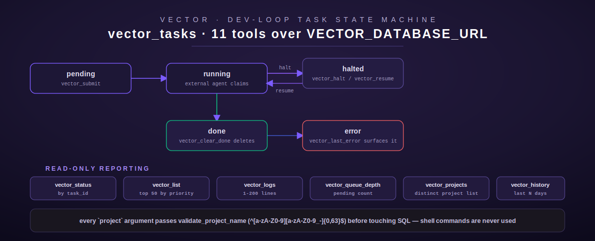

# vector

[← project-planning index](README.md) | [← docs index](../../README.md)

Vector is the autonomous dev-loop task queue — the largest module in this
domain (11 tools), giving an agent control over a project-scoped queue of
dev-loop work items: submit, inspect, halt/resume, inspect logs, clear
completed work, and report on error/queue-depth/history state. Source:
[`src/vector/mod.rs`](../../../src/vector/mod.rs).



## Overview

All 11 tools connect to a **separate** database from the rest of
project-planning: `VECTOR_DATABASE_URL`, read by `vector_db_url()`
(`src/vector/mod.rs:61-65`), not the shared `DATABASE_URL` used by axon,
nexus, and reminder. Each call opens its own short-lived pool via
`sqlx::postgres::PgPoolOptions::new().max_connections(2).connect(&db_url)` —
there is no persistent shared pool across calls.

Two tables are implied by the queries: `vector_tasks` (`id`, `project`,
`task`, `priority`, `status`, `created_at`, `updated_at`) and `vector_logs`
(`task_id`, `logged_at`, `message`).

**Project-name validation is the module's central safety mechanism.** Every
tool that accepts a `project` argument runs it through
`validate_project_name()` (`src/vector/mod.rs:27-55`) before it reaches SQL —
even though every query is already parameterized (`sqlx` bind parameters, so
SQL injection isn't actually possible through the query layer). The doc
comment is explicit that this exists "to prevent injection" and that "shell
commands are never used," but the validator's own test suite
(`test_invalid_project_name_shell_metachar_semicolon`,
`test_invalid_project_name_shell_metachar_pipe`,
`test_invalid_project_name_dollar_sign`, `src/vector/mod.rs:782-803`) reads
as future-proofing against a project name later being used to build a
filesystem path or shell command elsewhere in the system, not just an SQL
concern.

`validate_project_name` regex-equivalent: `^[a-zA-Z0-9][a-zA-Z0-9_-]{0,63}$`
— must start with a letter or digit, then any mix of letters, digits, `_`,
`-`, capped at 64 characters total.

**Env vars:** `VECTOR_DATABASE_URL` only.

**Auth / gating:** none — no tool in this module goes through
`crate::approval::gate`. `vector_clear_done` is a bulk `DELETE` with no
confirmation step beyond the tool call itself.

## Tool: `vector_submit`

**Purpose:** submit a new dev-loop task for a project. Source:
`src/vector/mod.rs:71-125`.

| Field | Type | Required | Default |
| --- | --- | --- | --- |
| `project` | string | yes | — |
| `task` | string | yes | — |
| `priority` | integer | no | `5` |

**Behavior:** validates `project` via `validate_project_name`, then `INSERT
... VALUES ($1,$2,$3,'pending',NOW()) RETURNING id`. `priority` is an
unbounded integer (not clamped to 1–10 despite the schema description saying
"Priority 1-10") — any `i64` value the caller sends is stored as-is; there is
no server-side range check.

**Output:** plain text — `"Task submitted. task_id={id}"`.

**Errors:** `InvalidArgument` (missing `project`/`task`, invalid project
name), `NotConfigured` (`VECTOR_DATABASE_URL` unset), `Database`.

## Tool: `vector_status`

**Purpose:** report a single task's status by id. Source:
`src/vector/mod.rs:131-178`.

| Field | Type | Required | Default |
| --- | --- | --- | --- |
| `task_id` | integer | yes | — |

**Behavior:** `SELECT project, status, priority FROM vector_tasks WHERE id =
$1` (no project-name validation needed — `task_id` is numeric). Returns
`NotFound` if no row matches.

**Output:** plain text — `"task_id={id} project={project} status={status}
priority={priority}"`.

## Tool: `vector_list`

**Purpose:** list up to 50 tasks for a project, priority-then-age ordered.
Source: `src/vector/mod.rs:184-239`.

| Field | Type | Required | Default |
| --- | --- | --- | --- |
| `project` | string | yes | — |

**Behavior:** `SELECT id, task, priority, status FROM vector_tasks WHERE
project = $1 ORDER BY priority DESC, created_at ASC LIMIT 50` — unlike axon,
this returns tasks in **all** statuses, not just pending, and the ordering
is a numeric `priority DESC` (higher number first), not a named-tier `CASE`
expression like axon's. The `LIMIT 50` is a hard cap with no pagination
parameter — a project with more than 50 tasks silently truncates.

**Output:** plain text. Empty: `"No tasks found for project '{project}'"`.
Non-empty: `"Tasks for '{project}':\n  [{id}] ({status}, p{priority}) {task}"`
per line.

## Tool: `vector_halt`

**Purpose:** pause a running task. Source: `src/vector/mod.rs:245-295`.

| Field | Type | Required | Default |
| --- | --- | --- | --- |
| `task_id` | integer | yes | — |

**Behavior:** `UPDATE vector_tasks SET status = 'halted', updated_at = NOW()
WHERE id = $1 AND status NOT IN ('done', 'error')` — a task in any
non-terminal state (including already `pending`, not just `running`) can be
halted; only `done`/`error` block it. Zero rows affected →
`NotFound("task_id={id} not found or already terminal")`.

**Output:** `"task_id={id} halted"`.

## Tool: `vector_resume`

**Purpose:** resume a halted task back to `running`. Source:
`src/vector/mod.rs:301-351`.

| Field | Type | Required | Default |
| --- | --- | --- | --- |
| `task_id` | integer | yes | — |

**Behavior:** `UPDATE vector_tasks SET status = 'running', updated_at = NOW()
WHERE id = $1 AND status = 'halted'` — strict: only a task currently
`halted` can be resumed (unlike halt's broader `NOT IN` predicate). Zero rows
→ `NotFound("task_id={id} not found or not in halted state")`.

**Output:** `"task_id={id} resumed (status=running)"`.

## Tool: `vector_logs`

**Purpose:** retrieve recent log lines for a task, in chronological order.
Source: `src/vector/mod.rs:357-415`.

| Field | Type | Required | Default |
| --- | --- | --- | --- |
| `task_id` | integer | yes | — |
| `lines` | integer | no | `50` (clamped `1..=200`) |

**Behavior:** `SELECT logged_at::text, message FROM vector_logs WHERE
task_id = $1 ORDER BY logged_at DESC LIMIT $2`, then the Rust code
`.rev()`s the result set before formatting so the tool's *output* reads
oldest-to-newest even though the *query* fetched newest-first (needed
because `ORDER BY ... DESC LIMIT N` is the only way to get "the last N" —
reversing after the fact restores chronological reading order).

**Output:** plain text, one `"[{timestamp}] {message}"` line per entry, or
`"No log entries for task_id={id}"` if empty.

## Tool: `vector_clear_done`

**Purpose:** bulk-delete all `done` tasks for a project — the only
destructive/irreversible tool in this module, and it is **not gated**.
Source: `src/vector/mod.rs:421-467`.

| Field | Type | Required | Default |
| --- | --- | --- | --- |
| `project` | string | yes | — |

**Behavior:** validates `project`, then `DELETE FROM vector_tasks WHERE
project = $1 AND status = 'done'`. Always succeeds (even deleting zero rows
is not an error) and reports the count removed.

**Output:** `"Cleared {N} completed task(s) from project '{project}'"`.

## Tool: `vector_projects`

**Purpose:** list every distinct project name that has at least one task.
Source: `src/vector/mod.rs:473-512`. No input fields (empty object schema).

**Behavior:** `SELECT DISTINCT project FROM vector_tasks ORDER BY project
ASC` — no filtering, no validation needed (no user input).

**Output:** `"Projects:\n{name}\n{name}..."` or `"No projects found"`.

## Tool: `vector_queue_depth`

**Purpose:** count pending tasks for a project. Source:
`src/vector/mod.rs:518-561`.

| Field | Type | Required | Default |
| --- | --- | --- | --- |
| `project` | string | yes | — |

**Behavior:** `SELECT COUNT(*) FROM vector_tasks WHERE project = $1 AND
status = 'pending'`. Always returns a count (0 if the project doesn't
exist or has no pending tasks) — never `NotFound`.

**Output:** `"project='{project}' pending_tasks={count}"`.

## Tool: `vector_last_error`

**Purpose:** surface the most recent task in `error` status for a project.
Source: `src/vector/mod.rs:567-617`.

| Field | Type | Required | Default |
| --- | --- | --- | --- |
| `project` | string | yes | — |

**Behavior:** `SELECT id, task, updated_at::text FROM vector_tasks WHERE
project = $1 AND status = 'error' ORDER BY updated_at DESC LIMIT 1`. If no
error task exists, this is **not** an error result — it returns
`Ok("No error tasks found for project '{project}'")`, distinguishing "queue
is healthy" from a tool failure.

**Output (found):** `"Last error in '{project}': task_id={id}
at={updated_at}\n  {task}"`.

## Tool: `vector_history`

**Purpose:** task history for a project over a lookback window. Source:
`src/vector/mod.rs:623-687`.

| Field | Type | Required | Default |
| --- | --- | --- | --- |
| `project` | string | yes | — |
| `days` | integer | no | `7` (clamped `1..=90`) |

**Behavior:** `SELECT id, task, status, created_at::text FROM vector_tasks
WHERE project = $1 AND created_at >= NOW() - ($2::bigint * INTERVAL '1
day') ORDER BY created_at DESC LIMIT 100` — a hard cap of 100 rows
regardless of how wide the day window is; a busy project over 90 days can
silently truncate.

**Output:** `"History for '{project}' (last {days} days):\n  [{id}]
{created_at} ({status}) {task}"` per line, or a "no tasks in the last N
days" message.

**Worked example (submit → halt → resume):**

```json
// 1. submit
{"project": "s110-docs", "task": "write project-planning module pages", "priority": 8}
// → "Task submitted. task_id=901"

// 2. halt
{"task_id": 901}
// → "task_id=901 halted"

// 3. resume
{"task_id": 901}
// → "task_id=901 resumed (status=running)"
```

## Registration

`pub fn register(registry: &mut ToolRegistry)` (`src/vector/mod.rs:694-711`)
registers all 11 tools via `register_or_replace`. No config validation at
registration time.

[← project-planning index](README.md) | [← docs index](../../README.md)
